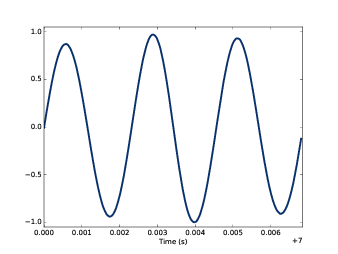
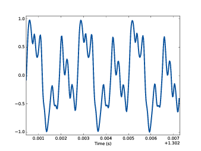
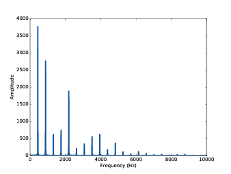
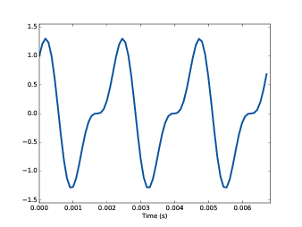

第一章：声音和信号
==================

**信号** 代表一个随时间变化的量。这个定义很抽象，我们用声音信号来作为一个更具体的例子。
声音是空气压力的变化产生的，声音信号则代表着空气压力随时间的变化。

麦克风能够测量这种变化并转换成可以表示声音的电信号。扬声器可以接收这种电信号并产生相应的声音。
像麦克风和扬声器这类的设备统称为 **信号变换器**，他们能够将一种信号变换为另一种信号。

本书会介绍信号处理的基础内容，包括信号的合成，变换和分析等。本书主要关注声音信号，但是同样的方法
完全可以运用于处理其他领域的信号，比如电信号，机械振动等。

他们同样也可以运用于其他随空间而非时间变化的信号，比如沿运动路径的高度变化信号。他们也可以运用于处理
多维的信号，例如图像或电影。图像可以看做是随二维空间变化的信号，电影则可以看做是随二维空间和时间同时
变化的信号。

但是，我们会从最简单的一维信号 声音信号 开始。

这章的代码 ``chap01.ipynb`` 可以在本书的 `代码库`_ 中找到，你也可以在 http://tinyurl.com/thinkdsp01 查看。

.. _代码库: https://github.com/AllenDowney/ThinkDSP

1.1 周期信号
--------------

我们先从 **周期信号** 开始。周期信号是按一定的周期重复出现的信号。例如当我们敲钟的时候，它会振动并发出声音，
如果把这个声音信号记录下来，可以画出如 `图1.1`_ 。

.. _图1.1:

    图1.1：一段钟声的信号

这个信号的形状与正弦曲线很相似，这就意味着它可以用三角函数来大致描述出来。

可以看出这个信号是周期的，在这个图中，我截取了三个重复循环（ **cycles** ）的信号，每个循环所经历的时间，
我们通常称作周期（ **peroid** ）, 这个信号的周期大概是 2.3 ms。

信号的频率（ **frequence** ）是指信号每秒重复循环的次数，是周期的倒数。频率的单位是赫兹（Hz）。

这个信号的频率大约是439Hz，略小于国际标准音高440Hz，用音名A表示，更准确说应该是A4，其中数字后缀表示所属八度音程，
A4与中央C属于同一个八度，A5则比A4高一个八度。如果不熟悉标准音高记法（scientific pitch notation）可以参考：
http://en.wikipedia.org/wiki/Scientific_pitch_notation 。

调音用的音叉会产生一个正弦信号，因为它尖端的振动是一个简谐运动。大部分乐器所产生的声音都是周期的，但是这些信号的形状
并不是简单的正弦曲线。例如，`图1.2`_ 显示了小提琴演奏的鲍凯利尼（Boccherini）的第5号E大调弦乐五重奏的第三乐章中
截取的一部分录音。

.. _图1.2:

    图1.2：一段小提琴的声音信号

从图中我们可以看出，这个信号是周期的，但是信号的形状要比正弦波要复杂一些。我们把信号的形状成为信号的波形（ **waveform** ）。
大多数乐器产生的波形都比正弦信号复杂，而不同的波形实际上决定了不同乐器的音色，也就影响着我们对声音的心理感受。相比于正弦波，
人们通常会感觉这些复杂的信号更加的丰富，更加的温度或者更加的有趣。

1.2 频谱分析
--------------

本书中一个重要的主题就是频谱分析。信号可以进行频谱分析时由于信号可以表示为不同频率的正弦信号的叠加结果，
这些不同频率的正弦信号的集合就是 **频谱** 。信号进过 **离散傅立叶变换** 可以得到它的频谱，
离散傅立叶变换（简称DFT），也是本书最重要的一个数学概念之一。

我们通过一个叫做 **快速傅立叶变换（FFT）** 的算法来计算信号的DFT，FFT也是本书最重要的算法之一。

例如，`图1.3`_ 显示了 `图1.2`_ 中小提琴声音的频谱。其中x轴代表了组成这个信号的正弦波频率的范围，
y轴显示了它们的强度（也叫做幅度）。

.. _图1.3:

    图1.3：小提琴声音的频谱

我们把频谱中最小的频率称作 **基频** 。这个信号的基频大概是440Hz（实际上要稍低一些）。

这个信号基频的幅度也是最大的，所以它也是这个信号的 **主导频率** 。通常我们对音高的感受取决于声音的
基频（即使它不是主导频率）。

这个频谱中其他幅度比较大的频率是880Hz，1320Hz，1760Hz和2200Hz，它们都是基频的整数倍，这些频率分量
称为信号的 **谐波（harmonics）** 。之所以叫做谐波，是因为它们和基频一起出现我们会觉得声音听起来比较和谐。

.. admonition:: 译者注

    对于声音信号来说，谐波的另一个名称是泛音。实际上，对于任何周期性的信号，进行傅里叶变换后都会得到谐波。
    因此，在翻译的时候，统一将harmonics以为谐波。

* 880Hz是A5的频率，它比基频高一个 **八度** 。一个八度的音程在频率上是两倍的关系。

* 1320Hz大约是E6的频率，它比A5高一个纯五度。如果你不熟悉音程（如纯五度）的概念，可以参考
  https://en.wikipedia.org/wiki/Interval_(music).

* 1760Hz是A6的频率，它比基频高两个八度。

* 2200Hz 大约是C#7，它比A6高一个大三度。

这些谐波的音如果在同一个八度中都是三和弦的组成部分。他们中有些频率是近似的是由于组成音阶的音的频率在
平均律下有一些小的调整。详见http://en.wikipedia.org/wiki/Equal_temperament。

给定这些谐波的频率以及相应的幅度，则我们可以通过直接叠加的方法重构出整个信号。接下来我们会学习这个方法。

1.3 信号
--------------

我编写了一个Python模块 ``thinkdsp.py`` ，其中包含了我们用于处理信号和频谱的类和函数。
你可以在本书的 `代码库`_ 中找到这些代码。

``thinkdsp`` 提供一个 ``Signal`` 类来表示信号，它是其他信号类型的父类，包括正（余）弦信号 ``Sinusoid`` 等。

使用 ``thinkdsp`` 可以像下面这样来构造一个正弦信号或是余弦信号::
    
    cos_sig = thinkdsp.CosSignal(freq=440, amp=1.0, offset=0)
    sin_sig = thinkdsp.SinSignal(freq=880, amp=0.5, offset=0)

``freq`` 参数代表频率（Hz）， `amp` 参数代表幅度（不指定单位则1.0代表可以录制和播放的最大的幅度）， 
``offset`` 参数代表初始相位（弧度），它决定了信号在 0 时刻的值。例如，一个 ``offset=0`` 的正弦信号
在 0 时刻的值为 ``sin(0)`` 也就是 0 ，而 ``offset=pi/2`` 的正弦信号在 0 时刻的值为 ``sin(pi/2)`` 也就是 1 。

``Signal`` 类中定义了 ``__add__`` 方法，因此我们可以使用 ``+`` 来对两个信号进行叠加::

    mix = sin_sig + cos_sig

两个信号相加的结果为 ``SumSingal``，他可以代表任意两个信号的叠加结果。

``Singal`` 实际上是由一个数学函数所定义的，大部分 ``Signal`` 定义了从时间的正无穷到负无穷上的值。

我们可以在一个时间区间上对一个信号进行求值（ **evaluate** ），也就是输入一个时间的序列 - ``ts``，计算信号在这些时间点上
相应的值 - ``ys`` 。我们使用 ``Numpy`` 的数组来表示 ``ts`` 和 ``ys`` ，并且将他们包装成一个叫做 ``Wave`` 的类中。

``Wave`` 表示信号在某个时间序列上的值，其中每个时间点叫做帧（ **frame** ），也可以叫做采样（ **sample** ），这两种叫法经常
可以混用。

``Signal`` 类提供了一个 ``make_wave`` 返回一个新的 ``Wave`` 对象::

    wave = mix.make_wave(duration=0.5, start=0, framerate=11025)

其中， ``duration`` 参数代表了需要求值的时间区间的长度（单位为秒）， ``start`` 参数代表开始时间（单位为秒）， 
``framerate`` 是一个整数，表示每秒的帧数，也叫做 **采样率** （单位也可用Hz表示）

这个例子中，11025Hz的采样率经常用于音频信号的采集中，如 WAV 和 MP3 。该例中我们求得了信号在 ``t=0`` 到 ``t=0.5`` 区间内
等间隔的5513个采样值，我们把两次采样之间的时间间隔称为时间步长（ **timestep** ），为采样率的倒数，这里的时间步长为 ``1/11025``
大约为 91 微妙

``Wave`` 提供了 ``plot`` 方法来画出波形图（使用 ``pyplot`` 模块实现）::

    wave.plot()
    pyplot.show()

``pyplot`` 是 ``matplotlib`` 库的一部分，是很常用的作图模块，他被包含在大部分的Python发行版中，当然你也可以手动安装它::

    pip install matplotlib

这个440Hz的信号在0.5s内有220个周期，因此上面的代码画出的图形看起来会像是一条很粗的实线。
我们可以使用 ``segment`` 方法来截取一个更小的时间范围的波形::

    period = mix.period
    segment = wave.segment(start=0, duration=period*3)

``period`` 是信号的一个属性，他返回信号的周期值（单位为秒）。

``start`` 和 ``duration`` 的单位也是秒。这段代码截取了 ``mix`` 信号一开始的三个周期，其结果 ``segment`` 也是一个 ``Wave`` 对象。

我们画出 ``segment`` 的波形图，如 `图1.4`_ 。这个信号包含了两个不同频率的成分，因此它的波形看起来会比音叉发出的正弦信号要复杂一些，
但是比小提琴发出的声音信号要简单一些。

.. _图1.4:

    图1.4：不同频率的两个正弦信号的合成信号波形

1.4 读写波形数据
------------------

``thinkdsp`` 提供 ``read_wave`` 函数从 WAV 文件中读取数据并返回一个 ``Wave`` 对象::

    violin_wave = thinkdsp.read_wave('input.wav')

``Wave`` 对象提供了 ``write_wave`` 方法将数据写入到 WAV 文件中::

    wave.write(filename='output.wav')

你可以用任意的媒体播放器来播放这些 WAV 文件。 在 UNIX 系统中，我通常使用 ``aplay`` ，这是一个简单而健壮的播放器，
多数的Linux发行版中都包含这个程序

``thinkdsp`` 也提供了一个直接播放声音的函数 ``play_wave`` ，它会在一个子进程中运行播放器来播放音频数据::

    thinkdsp.play_wave(filename='output.wav', player='aplay')

上面的代码中使用了默认的播放器 ``aplay`` ，当然你也可以通过 ``player`` 来指定其他的播放器。

1.5 频谱
----------

``Wave`` 中提供了 ``make_spectrum`` 来生成频谱 ``Spectrum`` ::

    spectrum = wave.make_spectrum()

``Spectrum`` 同样也提供了 ``plot`` 方法用于作图::

    spectrum.plot()
    thinkplot.show()

我在 ``thinkplot`` 模块中包装了一些常用的 ``pyplot`` 方法，这个模块也包含在本书的 `代码库`_ 中。

``Spectrum`` 提供了三个方法来对频谱进行变化：

* ``low_pass`` 会对频谱应用一个低通滤波器，也就是说，高于给定截止频率的分量会被衰减（幅度减小），
  衰减的程度由 ``factor`` 指定，通常为一个 [0, 1] 的数，默认为 0 （完全衰减）。 

* ``high_pass`` 会对频谱应用一个高通滤波器，也就是说，低于给定截止频率的分量会被衰减。

* ``band_stop`` 会对频谱应用一个带通滤波器，也就是说，在给定截止频率区间以外的分量会被衰减。

以下的代码将频谱的600Hz以上的频率成分衰减了99%::

    spectrum.low_pass(cutoff=600, factor=0.01)

低通滤波器去除了声音中的明亮的高频声音，使声音变得比较低沉。你可以通过将频谱转换为波形后来播放它::

    wave = spectrum.make_wave()
    wave.play('temp.wav')

``play`` 方法会将波形数据写入文件并且进行播放。如果使用 ``Jupyter notebooks`` ，你可以用 ``make_audio`` 
来生成一个音频部件。

1.6 波形对象
-------------

其实 ``thinkdsp.py`` 中并没有什么复杂的东西，它提供的大多数方法仅仅是对 ``Numpy`` 和 ``Scipy`` 的包装。
其中主要有三个类： ``Signal`` ， ``Wave`` 和 ``Spectrum`` 。
给定一个 ``Signal`` 可以生成一个 ``Wave`` ，
给定一个 ``Wave`` 可以生成一个 ``Spectrum`` ，反之亦然。 `图1.5`_ 展示了这些关系。

.. _图1.5:

    图1.5： ``thinkdsp`` 中各个类之间的关系图

``Wave`` 包含三个属性： ``ys`` 是包含信号值的Numpy数组； ``ts`` 是对应的时间数组； ``framerate`` 是采样率。
其中单位时间通常是秒，但是有些例子中也会使用其他的单位时间，例如天。

``Wave`` 还包含三个只读属性： ``start`` ， ``end`` 和 ``duration`` ，
这些属性由 ``ts`` 所决定，改变ts后这些属性会相应的改变。

我们可以通过直接改变 ``ts`` 以及 ``ys`` 来改变波形，例如::

    wave.ys *= 2
    wave.ts += 1

第一行代码将信号放大了两倍，使其音量变的更大。第二行代码将波形右移了一个单位时间，使其声音晚一秒钟才开始。

``Wave`` 也提供了很多方法来进行更常规的操作，例如以下两个变换与之前的代码效果一样::

    wave.scale(2)
    wave.shift(1)

这些方法的文档在 http://greenteapress.com/thinkdsp.html 中。

1.7 信号对象
-------------

``Signal`` 是所有信号的父类，其中提供了信号的基础方法，如 ``make_wave`` 。子类信号通过继承 ``Signal`` 并重写
``evaluate`` 方法来实现。 ``evaluate`` 方法用于计算信号在任意时刻的值。

例如， ``Sinusoid`` 子类的定义如下::

    class Sinusoid(Signal):
    
    def __init__(self, freq=440, amp=1.0, offset=0, func=np.sin):
        Signal.__init__(self)
        self.freq = freq
        self.amp = amp
        self.offset = offset
        self.func = func

其中构造参数包括：

* freq：信号的频率（Hz）

* amp：信号的幅度，通常单位为1

* offset：信号的初始相位，单位为弧度

* func：用于计算给定时间点的信号值的函数。可以为 ``np.sin`` 或 ``np.cos`` ，对应为正弦信号和余弦信号。

``Singal`` 类中的 ``make_wave`` 方法的代码如下::

    def make_wave(self, duration=1, start=0, framerate=11025):
        n = round(duration * framerate)
        ts = start + np.arange(n) / framerate
        ys = self.evaluate(ts)
        return Wave(ys, ts, framerate=framerate)

其中， ``start`` ``duration`` 为开始时间和持续时间（单位为秒），``framerate`` 是采样率（单位为Hz）。

``n`` 是采样点的总数， ``ts`` 用Numpy数组表示的采样时间

``make_wave`` 会调用 ``evaluate``  方法来计算信号在每个采样点的值 ``ys`` ， 
例如： ``Sinusoid`` 中的 ``evaluate`` 是这样的::

    def evaluate(self, ts):
        phases = PI2 * self.freq * ts + self.offset
        ys = self.amp * self.func(phases)
        return ys

让我们详细解释一下这个函数：

1. ``self.freq`` 是频率， ``ts`` 是采样时间序列，因此他们的乘积为采样的 ``cycle``

2. ``PI2`` 是常数 :math:`2\pi` ，把 ``cycle`` 与 :math:`2\pi` 相乘
就得到了相位（ **phase** ）。我们如果将波形循环一周的长度视作360°，即 :math:`2\pi` ，
那么相位就是信号在一周内所处的位置。

3. ``self.offset`` 是初始相位，也就是 ``t=0`` 时刻信号的相位。它实际上代表了波形的左右平移。

4. 如果 ``self.func`` 是 ``np.sin`` 或 ``np.cos`` 则计算的值会在[-1,1]的范围内。

5. 乘以 ``self.amp`` 使得最终的结果范围为[-self.amp, self.amp]。

``evaluate`` 用数字公式表示为：

.. math::

    y = A\cos (2\pi f t + {\varphi _0})

其中 :math:`A` 是幅度，:math:`f` 是频率，:math:`t` 是时间，:math:`{\varphi _0}` 是相位。
看起来好像我们用了很多代码来描述了一个简单的公式，实际上，我们得到了一个通用的框架来描述
所有类似的信号，而不仅仅是正余弦信号。

.. admonition:: 译者注

    在``thinkdsp.py`` 中除了正余弦信号外，有很多信号都继承自 ``Sinusoid`` ，
    包括三角信号 ``TriangleSignal`` ，方波信号 ``SquareSignal`` ， 
    锯齿信号 ``SawtoothSignal`` 等。这些信号的特征是都具有频率，幅度和初始相位的属性。

1.8 练习
----------------

在开始下面的练习之前，你可以从本书的 `代码库`_ 中下载本书的源码。
下面练习的答案可以参考文件 ``chap01soln.ipynb``

**练习1、** 如果你安装了 ``Jupyter`` ，使用它来打开 ``chap1.ipynb`` ，
阅读并且运行上面的代码示例。 如果没有 ``Jupyter`` ，可以在
http://tinyurl.com/thinkdsp01 浏览和运行它。

**练习2、** 在  http://freesound.org  上下载一段清楚的声音，可以是音乐，语音或其他的声音，
使用代码截取其中音高固定的半秒声音，并、计算并画出这段声音频谱，观察一下这个声音的音色
和它的频谱之间有什么样的关系。然后使用 ``high_pass`` ， ``low_pass`` ， ``band_stop`` 来
滤除其中的一些谐波分量，把他们在反过来转换为波形对象并播放，听一听与原来的声音有什么区别。

**练习3、** 产生一些正弦信号和余弦信号，并将他们相加合成一个复合信号。
然后生成并画出信号的波形以及频谱。播放这个声音听一听，看看如果频率分量不是基频的整数倍的时候，
声音是怎么样的。

**练习4、** 编写一个 ``stretch`` 函数，接收一个 ``Wave`` 对象以及一个伸缩因子，通过改变 ``ts``
和 ``framerate`` 来让波形变快或变慢。提示：仅需要两行代码就能实现这个功能。

