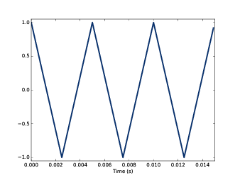
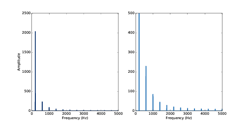
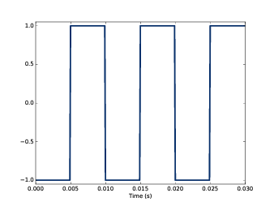
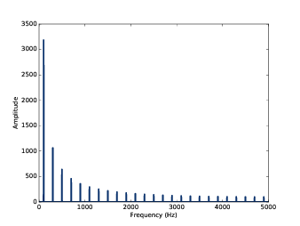
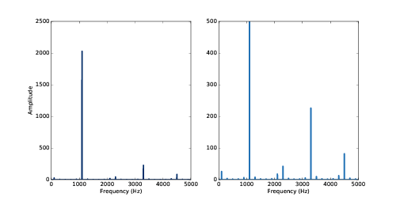
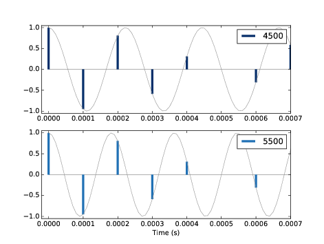

第二章：谐波
=============

在这章中我们会介绍几种新的波形以及他们的频谱，
理解频谱的谐波结构（ **harmonic structure** ），也就是构成整个频谱的正弦信号的集合。

另外，还会介绍在数字信号处理中的另一个重要的概念：混叠（ **aliasing** ）。
然后我会解释一下 ``Spectrum`` 是如何工作的。

这章的代码 ``chap02.ipynb`` 可以在本书的 `代码库`_ 中找到，你也可以在 http://tinyurl.com/thinkdsp02 查看。

.. _代码库: https://github.com/AllenDowney/ThinkDSP

2.1 三角波
------------

正弦信号仅包含一个频率分量，因此它的频谱只有一个峰值。多少复杂的信号，如小提琴声，它们的DFT会包含多个峰值。
这一小节，我们来研究这些波形和他们的频谱之间的关系。

我们先从三角波开始，`图2.1`_ 展示了一个200Hz的三角波，它的波形看起来像是把正弦信号拉直了。

.. _图2.1:

    图2.1： 200Hz的三角波波形图

你可以使用 ``thinkdsp.TriangleSignal`` 来生成一个三角波::

    class TriangleSignal(Sinusoid):
        
        def evaluate(self, ts):
            cycles = self.freq * ts + self.offset / PI2
            frac, _ = np.modf(cycles)
            ys = np.abs(frac - 0.5)
            ys = normalize(unbias(ys), self.amp)
            return ys

``TriangleSignal`` 继承自 ``Sinusoid`` ，
因此它同样包含 ``freq`` ， ``amp`` ， ``offset`` 三个属性。
不同在于它复写了 ``evaluate`` 。其中 ``ts`` 依然是采样点的时间，我们来看看这个 ``evaluate`` 是如何产生
三角波的：

1. ``cycles`` 表示从采样点的循环数。 ``np.modf`` 把它的小数部分提取出来放到 ``frac`` 中，它的整数部分
    被丢弃了

2. ``frac`` 现在是一个给定频率的0~1变化的斜坡信号，将它减去0.5会使其范围变到-0.5~0.5。然后取绝对值后，
    它的值就成了从0增加到0.5，再从0.5减小到0

3. ``unbias`` 会把整个信号向下移动，使其相对于y轴居中，然后 ``normalize`` 将信号的幅度放大到 ``amp`` 。

产生 `图2.1`_ 的代码如下::

    signal = thinkdsp.TriangleSignal(200)
    signal.plot()

接下来，我们可以用这个信号来产生波形对象，然后再生成它的频谱::

    wave = signal.make_wave(duration=0.5, framerate=10000)
    spectrum = wave.make_spectrum()
    spectrum.plot()

`图2.2`_ 显示了频谱图，右面的图在Y轴上进行了放大，这样可以更清晰的显示谐波结构。
像我们期望的那样，基频200Hz的幅值是最大的，其它谐波频率分量的峰值出现在200Hz的整数倍频率上。

        The version on the right cuts off the fundamental to show the harmonics more clearly.

    图2.2： 200Hz三角波在不同Y轴坐标尺度下的频谱图。
    右图中，为了更清除的展示谐波结构，基频的峰值没有全部显示出来

有一个奇怪的现象是：谐波里面没有基频的偶数倍的频率（400Hz，800Hz等），
而只有奇数倍的频率（600Hz，1000Hz，1400Hz等）。

这个频率的另一个特性是，随着谐波频率的增加，幅度的减弱与频率的平方大致呈比例的关系。
例如，600Hz的谐波是基频200Hz的3倍，他的幅度和基频的比例大约是9倍的关系（3的平方）。
而1000Hz的谐波是600Hz的1.7倍左右，他们的幅度之比大概是 :math:`{1.7^2} = 2.9` 。
我们把这种关系就称为 **谐波结构** 。

2.2 方波
-----------

``thinkdsp`` 还提供了 ``SquareSignal`` 类来表示方波信号，这个类的定义如下::

    def evaluate(self, ts):
        cycles = self.freq * ts + self.offset / PI2
        frac, _ = np.modf(cycles)
        ys = self.amp * np.sign(unbias(frac))
        return ys

类似 ``TriangleSignal`` 和 ``SquareSignal`` 这样继承自 ``Sinusoid`` 类及其构造函数 ``__init__`` 的类，
他们的共同点是都具有相同的构造参数：频率，幅度，初始相位。

``SquareSignal`` 的 ``evaluate`` 方法也具有类似的结构。其中 ``ts`` 依然是采样点的时间，
``frac`` 是它的小数部分，它的值从0到1周期的变化。

``unbias`` 将 ``frac`` 调整到-0.5~0.5，然后 ``np.sign`` 将结果的负值映射到-1，正值映射到1。
最后， ``amp`` 将信号的幅值调整到 -amp~amp 。

`图2.3`_ 显示了100Hz方波信号的三个周期， `图2.4`_ 显示了它的频谱。

.. _图2.3:

    图2.3：100Hz方波信号波形图

.. _图2.4:

    图2.4：100Hz方波信号的频谱图

和三角波一样，方波同样只包含奇数倍的谐波频率，它们的峰值在300Hz，500Hz，700Hz等。
但是它们幅度的减弱要比三角波慢一些（不是平方的关系）。

在本章后面的练习题中，你有机会发现一些其他的波形和它们的谐波结构。

2.3 混叠
-------------

坦白说，之前介绍的几个波形，都是我刻意挑选的，避免了比较的复杂的波形和频谱给大家带来困惑。
但是，接下来我会介绍一些比较复杂的情况。

`图2.5`_ 显示了一个1100Hz的三角信号在1KHz采样率下的频谱。右图是左图的放大后的图像，这样可以看的更清楚。

.. _图2.5:

        The view on the right is scaled to show the harmonics.

    图2.5：显示了一个1100Hz的三角信号在1KHz采样率下的频谱。右图是左图的放大后的图像

这个信号的谐波应该在3300Hz，5500Hz，7700Hz和9900Hz。图中可以看到我们期望的1100Hz和3300Hz的频率，
但是第三个峰值的频率是在4500Hz而不是5500Hz，第四个峰值的频率是在2300Hz而不是7700Hz，下一个峰值的频率
是100Hz而不是9900Hz，这是怎么回事呢？

造成这个情况的原因是，在计算整个信号的波形的过程中，实际上是在采样点在对信号进行了离散化的处理，因此
在连续信号的各个采样点之间会丢失掉一些信息。对于低频的信号丢失的信息不多，因为同样的采样率下，频率低
的信号在一个周期内可以有更多的采样点。

但是如果你用10000Hz的采样率来采集5000Hz的信号，一个信号周期内就仅有两个采样点了。实际上两个采样点是足够的，
但是如果信号的频率再高一点，一个周期内采样点小于两个，那么就会产生问题了。

为了解释这个现象，让我们来看两个余弦信号（4500Hz和5500Hz），我们使用10000Hz的采样率来计算他们的波形::

    framerate = 10000

    signal = thinkdsp.CosSignal(4500)
    duration = signal.period*5
    segment = signal.make_wave(duration, framerate=framerate)
    segment.plot()

    signal = thinkdsp.CosSignal(5500)
    segment = signal.make_wave(duration, framerate=framerate)
    segment.plot()

`图2.6`_ 中灰色的线是信号本身，而蓝色的竖线是采样后的信号。对比这两个图，可以发现，
两个不同的信号却产生了相同的采样值。

.. _图2.6:

        The signals are different, but the samples are identical.

    图2.6：10000Hz采样率下的4500Hz和5500Hz的余弦信号波形图

事实上，当我们用10000Hz采样率对5500Hz信号进行采样的时候，其结果与4500Hz的信号是相同的。
正是因为这样，7700Hz的信号和2300Hz的信号，9900Hz的信号和100Hz的信号在采样后也是相同的。

信号采样后产生的这种现象，我们就称为 **混叠（aliasing）** ，简单来说，就是高频的信号在采样后
会像是低频的信号。

在这个例子中（10000Hz采样率），我们最高可以采集的频率为5000Hz，也就是采样率的一半，高于5000Hz的
频率成分会被折叠刀5000Hz以内，因此我们把这个频率叫做折叠频率（floding frequence），
又称为 **奈奎斯特频率（Nyquist frequency）** 。参见 http://en.wikipedia.org/wiki/Nyquist_frequency 。

我们可以这样来计算折叠后的频率：如果信号的频率大于采样率，通过对信号频率与采样率相除求余，来得到在0到采样率之间
的频率，然后如果这个频率大于折叠频率，则用采样率减去这个频率，最后就得到了折叠后的结果。 例如，之前波形的第五个
谐波频率是12100Hz，求余后为2100Hz，就是折叠后的频率了。你也可以从 `图2.4`_ 上看到这个2100Hz的频率。同样，也可以
看到4300Hz的频率（14300Hz，折叠后为4300Hz）。

2.4 频谱的计算
----------------

在之前的章节中，我们多次使用了 ``make_spectrum`` ，它的代码（省略了一些细节）是这样的::

    from np.fft import rfft, rfftfreq

    # class Wave:
        def make_spectrum(self):
            n = len(self.ys)
            d = 1 / self.framerate

            hs = rfft(self.ys)
            fs = rfftfreq(n, d)

            return Spectrum(hs, fs, self.framerate)

``self`` 参数代表的是波形对象本身， ``n`` 是波形的采样点数目， ``d`` 是采样率的倒数，也就是采样时间步长。

``np.fft`` 是Numpy提供的FFT方法（一种高效的计算DFT的算法）。

``make_spectrum`` 使用了 ``rfft`` ，它的意思是“实数FFT”，如果信号是实数而不是复数，我们就可以使用它。
之后，我们会看到“完整FFT”，它可以处理复信号（见7.9）。 ``rfft`` 的结果 ``hs`` 是一个复数的Numpy数组，
它表示了各个频率分量的幅值和初始相位。

``rfftfreq`` 的结果 ``fs`` 包含了与 ``hs`` 对应的频率值。

对于 ``hs`` 中的复数，我们可以这样理解：

* 复数是实部和虚部的和，通常写成： :math:`x + iy` ，其中 :math:`i` 是单位虚数，也就是 :math:`\sqrt { - 1}` 。
  我们可以把复数的x和y看做是复数在复平面下的坐标（以实轴为横坐标，虚轴为纵坐标的直角坐标系）

* 复数也可以表示为幅值和复指数的形式，写成： :math:`A{e^{i\varphi }}` ，其中 :math:`A` 为模， 
  :math:`\varphi` 为幅角。我们可以把它看做是复数在极坐标下的表示。

.. admonition:: 译者注

    :math:`x + iy` 的极坐标表示为： :math:`A\cos (\varphi ) + A\sin (\varphi )i` ，
    根据欧拉公式 :math:`{e^{ix}} = \cos (x) + isin(x)` ，可以得出 :math:`A{e^{i\varphi }}` 

``hs`` 中的每个复数值就代表了该频率分量的复数表示：它的模值就是该频率的幅值，它的幅角就是该频率的初始相位。

``Spectrum`` 类中提供了两个只读的属性： ``amps`` 和 ``angles`` ，用来得到这些幅值和初始相位（它们都被
放在Numpy数组中）。我们在画频谱图的时候，实际上不是直接使用 ``fs`` ，而是使用 ``amps`` 和 ``angles`` 。

