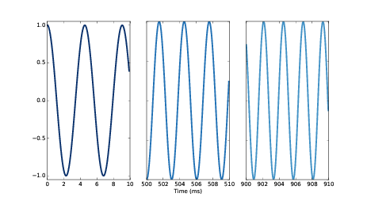
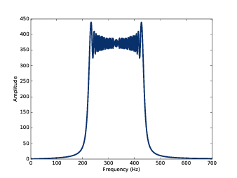
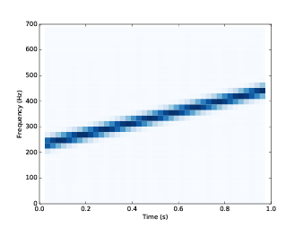
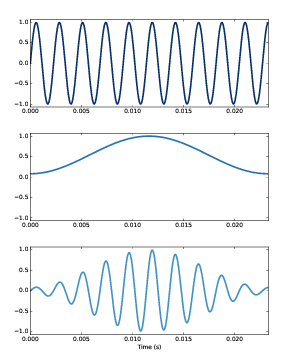

第三章：非周期信号
====================

到目前为止，我们学习到的信号都是周期的，它们会无限的重复并循环下去。
这也意味着，它们的频谱不会随着时间的变化而变化。
本章我们会学习非周期的信号，它们的频谱是随时间而变化。
几乎现实中的所有声音信号都是这样的非周期信号。

本章还会介绍声谱图（spectrograms），用于非周期信号的频谱的可视化。

这章的代码 ``chap03.ipynb`` 可以在本书的 `代码库`_ 中找到，你也可以在 http://tinyurl.com/thinkdsp03 查看。

.. _代码库: https://github.com/AllenDowney/ThinkDSP

3.1 线性啁啾声

我们先从啁啾声（ **chirp** ）开始，这是一种频率随时间变化的信号。 ``thinkdsp`` 中提供了一个 ``Chirp`` 类，
用来生成频率在一定范围内线性变化的正弦信号。

以下的代码生成了一个频率从220Hz变化到880Hz（从A3到A5升了两个八度）的 ``Chirp`` 信号::

    signal = thinkdsp.Chirp(start=220, end=880)
    wave = signal.make_wave()

`图3.1`_ 的三个图分别显示了这个信号开始，中间和结束的三段波形图。图中可以清晰的看出频率的变化。

.. _图3.1:

    图3.1： Chirp信号开始，中间和结束的波形图

我们先来看看 ``Chirp`` 是怎么实现的，下面是这个类的代码::

    class Chirp(Signal):
    
        def __init__(self, start=440, end=880, amp=1.0):
            self.start = start
            self.end = end
            self.amp = amp

        def evaluate(self, ts):
            freqs = np.linspace(self.start, self.end, len(ts)-1)
            return self._evaluate(ts, freqs)

        def _evaluate(self, ts, freqs):
            dts = np.diff(ts)
            dphis = PI2 * freqs * dts
            phases = np.cumsum(dphis)
            phases = np.insert(phases, 0, 0)
            ys = self.amp * np.cos(phases)
            return ys

构造函数 ``__init__`` 中 ``start`` 和 ``end`` 分别表示开始和结束的频率（单位为Hz）。 ``amp`` 表示幅值。

``evaluate`` 方法实现了信号的计算，其中 ``ts`` 表示采样点的时间序列。简单起见，我们假设采样的时间间隔是固定的。

假设 ``ts`` 的长度为 n, 就有 n-1 个时间段， 我们可以使用 ``np.linspace`` 求出对应的频率，也就是从 ``start``
到 ``end`` 的等间隔和 n-1 个值（Numpy数组）

``_evaluate`` 私有方法完成了接下来的数学运算  [1]_ 。其中 ``np.diff`` 计算了 ``ts`` 中相邻的采样点的时间间隔，
结果保存在 ``dfs`` 中。如果 ``ts`` 中的元素是等距的，那么 ``dts`` 中的值应该都是一样的。

接下来我们来计算在每个时间间隔内的相位变化。在 `1.7 信号对象`_ 中，我们看到当频率是常量的时候，相位 :math:`\varphi`
是相对时间线性变化的：

.. math::

    \varphi  = 2\pi ft

当频率随时间变化的时候，相位在短时间 :math:`\Delta t` 内的变化量是：

.. math::

    \Delta \varphi  = 2\pi f(t)\Delta t

因为 ``freqs`` 实际上就是 :math:`f(t)` ，而 ``dts`` 就是 :math:`\Delta t` ，因此上式可以写成如下的Python代码::

    dphis = PI2 * freqs * dts

现在 ``dphis`` 中包含了相位的变化量，我们可以通过累加来得到各个时间点的相位::

    phases = np.cumsum(dphis)
    phases = np.insert(phases, 0, 0)

``np.cumsum`` 方法计算出了累加值，可以看出来这个值的第一个元素不为0，因此我们需要使用 ``np.insert`` 在前面添加一个0值。
最后， 我们使用 ``np.cos`` 计算出了整个信号的值（记住相位是用弧度表示的）。

实际上，如果用微积分来表示，当 :math:`\Delta t` 足够小的时候：

.. math::

    d\varphi  = 2\pi f(t)dt

两边同时除以 :math:`dt` 得到：

.. math::

    \frac{{d\varphi }}{{dt}} = 2\pi f(t)

也就是说，相位的微分就是频率。反过来，相位应该是频率的积分。所以，我们可以使用 ``np.cumsum`` 累加来得到相位，
因为累加实际上就是积分的近似计算方法。

.. admonition:: 译者注

    译者觉得这里其实没必要使用累加来计算，因为线性变化的频率很容易可以求得解析解。考虑到相位的微分就是频率，
    如果希望频率线性变化，那么 :math:`f(t) = at + b`，
    那么相位就是频率的不定积分 :math:`\varphi  = \frac{a}{2}{t^2} + bt + c` ，
    考虑到单位转换后，最后的信号随时间变化公式为：:math:`s = \cos (2\pi (\frac{a}{2}t + b)t + c)`
    已知 ``ts`` 和 ``start`` ``end`` ，很容易可以得到 a 和 b 的值，最终 ``evaluate`` 的代码如下::

        def evaluate(self, ts):
            k = (self.end - self.start) / (ts[-1] - ts[0]) / 2
            freqs = k*(ts-ts[0])+self.start
            phases = 2 * np.pi * freqs * ts
            ys = self.amp * np.cos(phases)
            return ys

    有兴趣的读者可以尝试使用这个方式来构造信号，看和书中提供的方法产生的信号是否一致。

3.2 指数啁啾声
-----------------

当你听这个啁啾声的时候，你会发现一开始音高上升的很快，然后会慢下来。这个啁啾声跨越了两个八度，
跨越第一个八度只用了 1/3s 时间，而第二个八度用了 2/3s。

造成这个现象的原因是我们感受到的音高取决于频率的对数，也就是说我们听到的两个声音的音高间隔
取决于它们之间的频率比值，而不是差值。用音乐的术语来说，两个音高之间的间隔，被称为音程（ **interval** ）

例如，一个八度指的是频率之比为2的两个音高之间的间隔。因此从220Hz到440Hz为一个八度，
从440Hz到880Hz又是一个八度。虽然他们之间的频率差更大，但是他们的音程是一样的。

因此，如果频率是线性升高的，那么听起来音高是按对数升高的。

如果我们想得到音高按线性变化的信号，那么信号的频率就得按指数变化。这种信号我们成为指数啁啾声。代码如下::

    class ExpoChirp(Chirp):
    
        def evaluate(self, ts):
            start, end = np.log10(self.start), np.log10(self.end)
            freqs = np.logspace(start, end, len(ts)-1)
            return self._evaluate(ts, freqs)

这里我们使用了 ``np.logspace`` 来替代 ``np.linspace`` ，它可以产生按指数变化的序列值。

其他的代码与之前的 ``Chirp`` 是一样的，我们使用它来生成一个指数啁啾声::

    signal = thinkdsp.ExpoChirp(start=220, end=880)
    wave = signal.make_wave(duration=1)

你可以在 ``chap03.ipynb`` 中听一听这些信号的区别。

3.3 啁啾声的频谱
---------------------

啁啾声的频谱图是怎样的呢？这里我们构造了一个1s内八度的信号，并且计算出了它的频谱::

    signal = thinkdsp.Chirp(start=220, end=440)
    wave = signal.make_wave(duration=1)
    spectrum = wave.make_spectrum()

`图3.2`_ 展示了这个频谱图。可以看到，这个信号包含从220Hz到440Hz的所有频率成分。
还可以注意到，在220Hz到440Hz区间内，频谱图大概是平的，这就表明频率在时间上是均匀变化的。
基于此我们可以猜测指数啁啾声的频谱是什么样子的吗？

.. _图3.2:

    图3.2： 1s升八度的Chirp信号

实际上，从频谱图中，我们可以得到信号的频率成分的信息，但是却掩盖了频率随时间变化的信息。
我们不能从频谱中看出信号的频率是随时间变大还是变小了。

3.4 声谱图
----------------

为了展示信号频率随时间变化的关系，我们可以把信号分段后分别计算频谱，然后画出每段的频谱图。
这种方法我们成为 **短时傅立叶变换（STFT）** 。

我们常用声谱图（ **spectrogram** ）来可视化STFT的结果。声谱图的x轴是时间，y轴是频率。
声谱图中的每列显示了一小段时间内信号的频谱，使用灰度值（或颜色亮度）来表示幅值大小。

我们以 ``Chirp`` 信号作为例子来计算声谱图::

    signal = thinkdsp.Chirp(start=220, end=440)
    wave = signal.make_wave(duration=1, framerate=11025)
    spectrogram = wave.make_spectrogram(seg_length=512)
    spectrogram.plot(high=700)

``Wave`` 类提供了 ``make_spectrogram`` 来生成声谱图。其中 ``seg_length`` 表示每段包含的采样点数。
这里使用了512，通常情况使用2的n次方的值可以提升FFT的效率。`图3.3`_ 为生成的声谱图。

.. _图3.3:

    图3.3： 1s升八度的Chirp信号的声谱图

图中，x轴的时间范围从0s到1s，y轴频率范围从0Hz到700Hz。因为信号频率成分比较低，为了更清除的展示，
我把整个声谱图的上部分裁剪了，实际上完整的频率范围是0~5512.5Hz，即采样率的一半。

声谱图清楚的展示了信号频率随时间的变化情况。但是，我们也可以注意到，图中每列的峰值都有2-3个单位的模糊，
实际上这反应了声谱图的频率分辨率是有限的。

3.5 Gabor limit
-----------------

声谱图在时域上的分辨率是分段的时间长度，在图中对应的是每个色块的宽度。上例中，每段是512个采样点，
在11025Hz的采样率下，大概是0.046s。

而声谱图在频域上的分辨率是频谱上两个相邻频率的间隔，在图中对应的是每个色块的高度。
上例中，对每段512个采样点进行频谱计算后，可以得到分布在0~5512.5Hz的256个频率分量，
也就是说频率分辨率为 5512.5/256 大约为 21.6Hz。

更普遍的来说，如果 *n* 是分段的长度，那么频谱应该包含 *n/2* 个分量。
在采样率为 *r* 的情况下，最大的频率分量应该为 *r/2* 。
因此频率分辨率为： :math:`\frac{{r/2}}{{n/2}}`，即 *r/n* 。
另一方面时间分辨率为分段的长度，即 *n/r* 。

我们通常希望时间分辨率的值越小越好，这样我们才能够反应出频率的快速变化。
同时，我们也希望频率分辨率的值越小越好，这样才能更准确的描述频率的分布情况。
然而，事实上这两点并不能同时满足，因为时间分辨率 *n/r* 正好是频率分辨率 *r/n*
的倒数，也就是说如果一个值变小，那么另一个值就会相应的变大。

例如，如果我们把分段的长度变长两倍，那么同时我们得到的频率分辨率就会减小一半。
即使我们提高采样率也无济于事，因为虽然采样点多了，但是同时获得的频谱的范围也相应的增大了。

这是在进行时频分析时的一个基本原理，称为为 **Gabor limit** 。

.. admonition:: 译者注

    我没有找到 **Gabor limit** 的准确翻译，实际上这是一种不确定性原理，
    可以参考 https://en.wikipedia.org/wiki/Uncertainty_principle#Signal_processing 。

3.6 频谱泄露
-------------

在介绍 ``make_spectrogram`` 的工作原理前，我想先介绍一下窗的概念。
这里，我们先研究一个叫做频谱泄露的问题。

计算离散傅立叶变换（DFT）的时候，我们是把有限长度的信号看成是周期信号来处理的，
也就是说，DFT假定进行变换的有限长度信号是一个无限长度的周期信号的一个完整周期。
但是，这个假设通常是错的，并且会产生一些问题。

因为DFT计算的时候是把信号的开始拼接到信号的末尾来构成无限循环的周期信号的。
因此一个普遍的问题是在这个信号的开始和结束的值并不相等，使得最终扩展的周期信号不连续。
这种不连续会造成频谱中包含一些本来不属于信号本身的频率分量。

.. _图3.4:

.. figure:: images/thinkdsp015.png
    :alt: Spectrum of a periodic segment of a sinusoid (left), 
        a non-periodic segment (middle), a windowed non-periodic segment (right)
    :align: center

    图3.4： 整数倍周期的频谱（左），非整数倍周期的频谱（中），非整数倍周期加窗后的频谱（右）

我们用一个440Hz的正弦信号作为例子，理论上它的频谱应该只有一个440Hz的频率分量::

    signal = thinkdsp.SinSignal(freq=440)

如果我们选择一个整数倍周期的时间段来计算频谱，这样它的首尾相连就是连续的，
那么结果没有什么问题::

    duration = signal.period * 30
    wave = signal.make_wave(duration)
    spectrum = wave.make_spectrum()

就像我们期望的那样，这个频谱只有一个440Hz的峰值， `图3.4`_ 的左图展示了这个结果。

但是如果我们选择一个非整数倍周期的长度来计算频谱，就有问题了。
例如 ``duration = signal.period * 30.25`` ，这个信号从0开始，以1结束。

`图3.4`_ 的中图展示了这个信号的频谱图。可以看到除了440Hz的峰值之外，
频谱中还有一些其他的频率分量，它们分布在240~640Hz之间。
这种现象，我们就称为 **频谱泄露（spectral leakage）** ，因为整个信号的能量从基频
泄露了一部分到其他的频率上。

在这个例子就是由于我们选了一个非周期的时间段，使得DFT扩展后的周期信号不连续，从而导致了频谱泄露。

3.7 窗函数
--------------

我们可以通过把不连续的首尾连接处做平滑处理来减小泄露的产生，
**加窗（windowing）** 就是进行平滑的一种方法。

.. _图3.5:

        product of the segment and the window (bottom).
    :align: center

    图3.5 正弦信号（上），汉明窗（中），加窗后的信号（下）

窗函数就是用来将非周期的信号段转变为周期的信号段的函数。 `图3.5`_ 的上图显示了
一个首尾不连续的信号段的波形。

`图3.5`_ 的中图展示了一个汉明窗（Hamming window）的形状，这是一个常用的窗函数。
每种窗函数都有各自不同的应用场景，没有哪一个是完美的，而汉明窗是一个比较好的通用窗函数。

`图3.5`_ 的下图展示了信号加窗后（信号与窗函数相乘）的波形。这样处理之后，在窗函数值的1的时候，
信号是不变的，而在窗函数值为0的时候信号就被衰减了。由于窗函数的中间部分值比较大，而两端慢慢的
减小到0，因此信号的两端也被逐渐的衰减到0，最终的结果就是加窗后的信号首尾连接处被平滑了。

`图3.4`_ 的右图展示了这个加窗后的信号的频谱图，可以看到，加窗后在很大程度上的减小了频率泄露，
但是并没有完全消除。

``Wave`` 类中提供了加窗的方法 ``window`` ，代码如下::

    #class Wave:
        def window(self, window):
            self.ys *= window

Numpy提供了一些常用的窗函数，其中 ``hamming`` 可以产生一个给定长度的汉明窗，
下面的代码对波形应用了一个汉明窗::

    window = np.hamming(len(wave))
    wave.window(window)

Numpy提供的窗函数包括： ``bartlett`` ， ``blackman`` ， ``hanning`` 和 ``kaiser`` 。
你可以在本章后面的练习中对这些窗函数进行试验。

3.8 声谱图的实现
-------------------

.. [1] 方法名前面加下划线表示这个方法是私有的，不应该在外部进行调用
    

