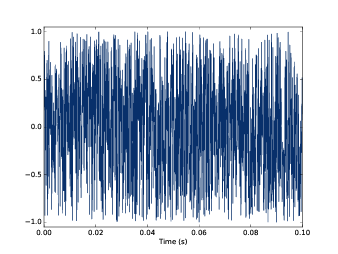
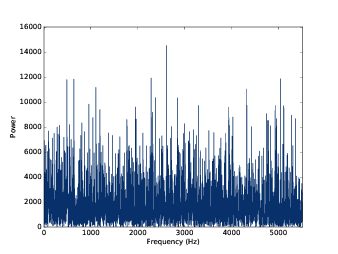
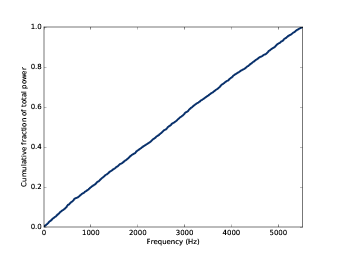
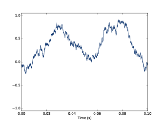
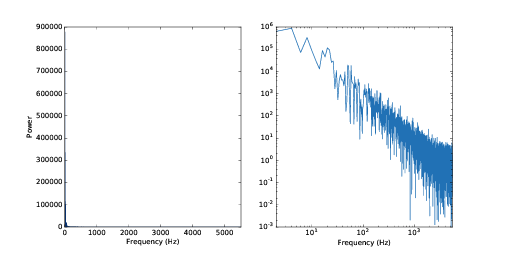

第四章：噪声
==============

通常我们所说的噪声（noise）指的是那些听起来混乱不舒服的声音。在信号处理中，噪声有两个不同的意思：

1. 噪声是指那些我们不期望出现的信号。例如，两个信号重合在一起相互干扰，
   那么对于其中的一路信号来说，另一路信号就是噪声。 

#. 噪声还指那些频谱中包含几乎所有的频谱成分，不具有前几章那些周期信号的谐波结构的信号。

本章主要关注噪声的第二种意思。

这章的代码 ``chap04.ipynb`` 可以在本书的 `代码库`_ 中找到，你也可以在 http://tinyurl.com/thinkdsp04 查看。

.. _代码库: https://github.com/AllenDowney/ThinkDSP

4.1 不相关噪声
-----------------

了解噪声的一种最简单的方法就是去生成噪声。不相关的均匀噪声（UU noise）就是一种很容易生成的噪声。
均匀（Uniform）的意思是信号的值是随机的并且服从均匀分布，也就是说在一定范围内信号出现任意值的概率
都是一样的。不相关（Uncorrelated）的意思是信号在不同时间的值是独立不相关的；也就是说，
某一时刻的信号值不能够提供其他任何时候的信号值的信息。

下面这个类就是UU噪声::

    class UncorrelatedUniformNoise(_Noise):

        def evaluate(self, ts):
            ys = np.random.uniform(-self.amp, self.amp, len(ts))
            return ys

``UncorrelatedUniformNoise`` 继承自 ``_Noise`` ，而 ``_Noise`` 又继承自 ``Signal`` 。

``evaluate`` 方法传入参数 ``ts`` ，也就是信号求值的采样点时间，然后使用 ``np.random.uniform`` 生成
服从在[-amp,amp]范围均匀分布的值。

下面的代码生成了在11025Hz采样率下的0.5s的UU噪声::

    signal = thinkdsp.UncorrelatedUniformNoise()
    wave = signal.make_wave(duration=0.5, framerate=11025)

播放这个波形，你会发现它听起来像是我们切换广播频道时的那种静态噪声。 
`图4.1`_ 显示了这个噪声的波形，就像之前所说的，它的值是随机的。

.. _图4.1:

    图4.1： UU噪声的波形图

接下来我们来看看它的频谱::

    spectrum = wave.make_spectrum()
    spectrum.plot_power()

``spectrum`` 的 ``plot_power`` 方法与 ``plot`` 方法类似，区别在与它画的是
功率（Power）而不是幅值，功率是幅值的平方。在研究噪声的情况下，我们使用功率
比使用幅值更方便。

.. _图4.2:

    图4.2： UU噪声的功率谱

`图4.2`_ 展示了这个频谱图。与波形图一样，它的频谱图看起来也是随机的。
实际上，它确实是随机的，但是在这里，我们得更加精确的定义一下“随机”这个词。
对于噪声信号来说，我们需要关注它的三种性质：

* 分布（Distribution）：随机信号的分布值的是他们可能产生的值以及产生这些值的概率。
  例如，在均匀噪声中，信号的值可以在[-1,1]的范围中，产生这些值的概率都是一样的。
  而高斯噪声（ **Gaussian Noise** ）则不同，它的值可以从负无穷到正无穷，但是越接近0
  的值出现的概率越高，它的概率分布图是一个高斯分布曲线（也叫正态分布曲线或钟型曲线）。

* 相关性（Correlation）：表示信号的不同值之间是独立的或是有一些依赖关系。在UU噪声中，
  所有的值都是独立的。而布朗噪声（ **Brownian noise** ）则不同，它的每个值都是前一时刻
  信号的值再加上一个随机的“步值（step）”。因此，如果某一个时刻信号的值比较大，
  我们会预测它会保持比较大的值，反之亦然。

* 功率和频率之间的关系：在UU噪声中，所有频率成分的功率看起来是均匀分布的，也就是说信号的功率
  被平均分布到的所有的频率成分上。而分红噪声（ **Pink Noise** ）则不同，
  它的功率与频率成反比例关系，也就是说对于频率为 *f* 的成分来说，它的功率为 *1/f*

4.2 频谱积分
-------------------

对于UU噪声来说，我们可以通过对频谱进行积分（ **integrated spectrum** ）来更清晰的观察到频率和
功率之间的关系。频谱积分就是计算频率从0到f上的功率的累加和。

``spectrum`` 类提供了一个方法来产生积分后的频谱::

    def make_integrated_spectrum(self):
        cs = np.cumsum(self.power)
        cs /= cs[-1]
        return IntegratedSpectrum(cs, self.fs)

``self.power`` 是包含每个频率成分的功率的Numpy数组， ``np.cumsum`` 用于计算累加和。
除以最后一个元素的值可以将积分后的值进行归一化。最后返回了 ``IntegratedSpectrum`` 对象，
这个类的定义如下::

    class IntegratedSpectrum(object):    
        def __init__(self, cs, fs):
            self.cs = cs
            self.fs = fs

和 ``spectrum`` 一样， ``IntegratedSpectrum`` 也提供 ``plot_power`` 方法用来计算并作图::

    integ = spectrum.make_integrated_spectrum()
    integ.plot_power()

如 `图4.3`_ 所示，积分后的频谱是一条直线，表示所有频率成分的平均功率是一个常值。
像这样的噪声，我们称为 **白噪声（white noise）** ，之所以叫白噪声，是因为如果灯发出所有频率的可见光
并且功率都一样，那么灯光的颜色应该是白色的。

.. _图4.3:

    图4.3： UU噪声的积分频谱

4.3 布朗噪声
---------------

UU噪声是不相关的，每个时刻的值互相都是独立的。而布朗噪声就是相关的，它的值是上一时刻的值加上一个随机的步长。
之所以叫布朗噪声，是由于它和布朗运动很类似。悬浮在液体上微小粒子由于受到分子的撞击产生的无规则运动，被称为
布朗运动，在数学上，可以用 **随机游走（random walk）** 来描述，也就是每步运动的距离服从一定的随机分布。

以一维的随机游走来说，每次微粒向上或者向下移动一个随机的距离，那么微粒的位置应该等于之前移动的距离之和。
我们可以用这个思路来生成一个布朗噪声：先生成一个不相关的随机步长，然后将他们累加，如下面的代码::

    class BrownianNoise(_Noise):

        def evaluate(self, ts):
            dys = np.random.uniform(-1, 1, len(ts))
            ys = np.cumsum(dys)
            ys = normalize(unbias(ys), self.amp)
            return ys

``evaluate`` 使用了 ``np.random.uniform`` 来生成不相关的均匀分布的步长，
然后用 ``np.cumsum`` 来计算累加值。
然后用 ``unbias`` 来调整信号的偏移量，使其均值为0，最后用 ``normalize`` 调整到给定的最大幅值。

下面的代码生成了一个布朗噪声，并画出了波形图::

    signal = thinkdsp.BrownianNoise()
    wave = signal.make_wave(duration=0.5, framerate=11025)
    wave.plot()

如 `图4.4`_ 所示，布朗噪声的波形在上上下下的变化，但是连续的两个值之间有明显的相关性，
当值比较大的时候，下一个值也趋向于保持较大的值，反之亦然。

.. _图4.4:

    图4.4： 布朗噪声的波形图

.. _图4.5:

    图4.5： 布朗噪声在线性刻度下的频谱图（左）和在对数刻度下的频谱图（右）

在线性刻度下，布朗噪声的频谱图的几乎所有的频率成分都在最是低频，高频分量几乎不可见，如 `图4.5`_ 左图。

为了更清除的显示频谱图，我们将它画在对数刻度坐标中，代码如下::

    spectrum = wave.make_spectrum()
    spectrum.plot_power(linewidth=1, alpha=0.5)
    thinkplot.config(xscale='log', yscale='log')

如 `图4.5`_ ，可以看出频率和功率的关系虽然也呈现噪声的特点，但是又有一定的线性规律。

``Spectrum`` 类中还提供了 ``ectimate_slope`` 方法使用 ``Scipy`` 中的最小二乘法来对功率谱进行拟合::

    #class Spectrum

        def estimate_slope(self):
            x = np.log(self.fs[1:])
            y = np.log(self.power[1:])
            t = scipy.stats.linregress(x,y)
            return t

由于 log0 是未定义的，因此我们的代码去掉了频率为0的分量。
``estimate_slope`` 使用了 ``scipy.stats.linregress`` 来计算最小二乘，返回值 ``t`` 中包含了拟合直线的
斜率和截距，相关系数，P值以及标准差。这里，我们只关心斜率和截距。

 对于布朗噪声来说，斜率是 *-2* （见 `第九章`_ ），我们可以把频率和功率的关系写成如下形式：

.. math::

    \log P = k - 2\log f

这里 *P* 代表功率， *f* 代表频率， *k* 代表直线的截距（不重要）。将等式两边求幂后得到：

.. math::

    P = K/{f^2}

这里的 *K* 等于 :math:`{e^k}` （依然不重要）。我们可以看到布朗噪声的一个很重要的特性就是
它的功率与 :math:`1/{f^2}` 成正比例关系。

与白噪声类似，由于呈现这种频率-功率关系的灯光是红色的，我们也把布朗噪声称为 **红噪声（red noise）**。

