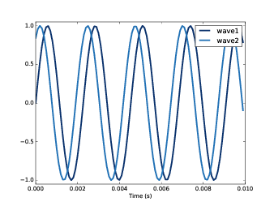
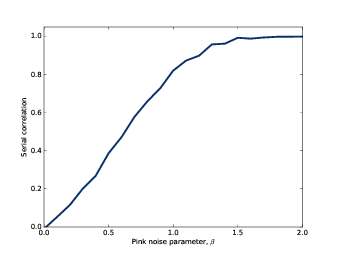
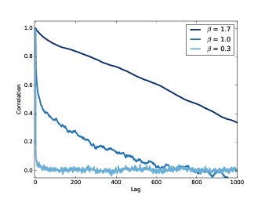
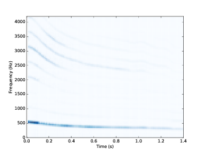
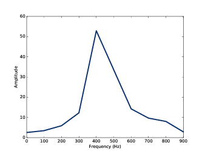
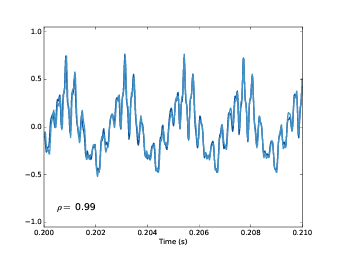
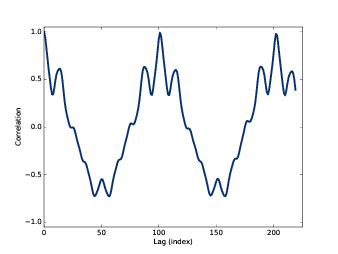

第五章：自相关
===================

上一章中，我们说白噪声是不相关的，它任意时刻的值相互之间都是独立的。
而布朗噪声是相关的，它某个时刻的值依赖于上一个时刻。
这章中，我们引入 **自相关函数（autocorrelation function）** 
来精确的定义这些概念，这在信号分析中是很有用的一种方法。

这章的代码 ``chap05.ipynb`` 可以在本书的 `代码库`_ 中找到，你也可以在 http://tinyurl.com/thinkdsp05 查看。

.. _代码库: https://github.com/AllenDowney/ThinkDSP

5.1 相关性
---------------

通常来说，如果一个变量与另一个变量相关，那么意味着如果知道一个变量的值就可以得到另一个变量的一些信息。
我们有好几种方式来度量相关性，
其中最常见的一种是皮尔森相关系数（Pearson product-moment correlation coefficient），
记为： :math:`\rho` 。对于两个均包含N个测量值的变量 *x* 和 *y* ，

.. math::

    \rho  = \frac{{\sum\limits_i {({x_i} - {\mu _x})({y_i} - {\mu _y})} }}{{N{\sigma _x}{\sigma _y}}}

上式中的 :math:`{\mu _x}` 和 :math:`{\mu _y}` 是 *x* 和 *y* 的均值， :math:`{\sigma _x}` 和
 :math:`{\sigma _x}` 是它们的标准差。

皮尔森相关系数总是在[-1,1]的范围内，如果是正值，表示两个变量正相关，也就是说一个变量如果比较大，
那么另一个也趋向于变大，相反，如果是负值，那么表示两个变量如相关，也就是说一个变量如果比较大，
那么另一个会趋向于变小。

:math:`\rho` 的大小表示两个变量之间的相关程度，越大就越相关。如果 :math:`\rho` 是1或-1，
则说明它们是完全相关的，如果我们知道其中一个的值，就能准确预测出另一个值。如果 :math:`\rho` 
接近0，说明它们之间的相关性可能很弱，也就是知道其中一个的值，对于我们预测另一个的值来说没有什么意义。

这里，我用了“可能很弱”，是因为如果它们之间是非线性的关系，那么相关系数并不能很好的表征这种非线性关系。
在统计学中，非线性相关性也很重要，但是在信号处理中没有那么常见，因此这里我们先不考虑它。

Python中有很好几种方法来计算相关性。其中 ``np.corrcoef`` 可以计算多个变量两两之间的相关系数，结果用
一个 **相关矩阵（correlation matrix）** 来表示。

这里以两个变量为例，首先我构造了一个生成不同初始相位的正弦信号的函数，如下::

    def make_sine(offset):
        signal = thinkdsp.SinSignal(freq=440, offset=offset)
        wave = signal.make_wave(duration=0.5, framerate=10000)
        return wave

然后我们生成了两个不同相位的正弦信号::

    wave1 = make_sine(offset=0)
    wave2 = make_sine(offset=1)

`图5.1`_ 显示了这两个信号的前几个周期的波形。可以看到，一个信号的值比较大的时间，另一个的值也相对比较大，
感觉它们之间应该是相关的。

.. _图5.1:

        their coefficient of correlation is 0.54
    :align: center

    图5.1： 两个相位差1弧度的正弦信号波形

它们之间的相关系数计算如下::

    >>> corr_matrix = np.corrcoef(wave1.ys, wave2.ys)
    [[ 1.    0.54]
    [ 0.54  1.  ]]

结果是一个相关矩阵，每个位置的值都代表的是对应的行号和列号两个信号之间的相关系数。
例如，第一行第一列元素的值代表了 ``wave1`` 和自身的相关系数，同样第二行第二列的值代表了
``wave2`` 和自身的相关系数。

其中分对角元素的值是我们所关心的，也就是 ``wave1`` 和 ``wave2`` 之间的相关系数0.54，
表明了它们之间有一定的相关性。

当它们之间的相位差增大时，它们的相关系数会减小直到相位差为180°，这时相关系数为-1。然后，
随着相位差继续增大，相关系数值又会增大直到360°，这个时候它们的相关系数为1.

`图5.2`_ 显示了它们之间的相关系数随相位差变化的情况。这个曲线的形状你应该很熟悉，它是余弦曲线。

.. _图5.2:

.. figure:: images/thinkdsp027.png
    :alt: The correlation of two sine waves as a function of 
        the phase offset between them. The result is a cosine
    :align: center

    图5.2： 正弦信号相关系数随相位差变化曲线

``thinkdsp`` 中提供一个简单的方法来计算波形之间的相关性::

    >>> wave1.corr(wave2)
    0.54

5.2 序列相关性
----------------

信号一般情况下都是对某个量的在一段时间内的连续测量值。
例如，声音信号就是在一段时间内我们对声压相对应的电压（电流）的测量值。

像这样的测量值都具有序列相关性，它表示一段测量序列中的不同时刻的测量值之间的相关性。
我们可以通过对信号进行移位后，在于原始信号计算相关系数来得到序列相关性::

    def serial_corr(wave, lag=1):
        n = len(wave)
        y1 = wave.ys[lag:]
        y2 = wave.ys[:n-lag]
        corr = np.corrcoef(y1, y2, ddof=0)[0, 1]
        return corr

``serial_corr`` 接受一个波形对象和 ``lag`` （一个整数，表示移位的位置）作为参数，
然后计算出移位后的波形和原始波形间的相关系数。

我们用上一章中的UG噪声信号来对这个函数进行测试::

    signal = thinkdsp.UncorrelatedGaussianNoise()
    wave = signal.make_wave(duration=0.5, framerate=11025)
    serial_corr(wave)

这个代码运行的结果是0.006，这表示信号的序列相关性很小。你可以试试用不同的 ``lag`` 值，
你会发现它们同样都很小。这是因为UG噪声是不相关的。

而对于布朗噪声来说，它的值是上一时刻的值加一个随机的步长，因此应该具有较大的序列相关性::

    signal = thinkdsp.BrownianNoise()
    wave = signal.make_wave(duration=0.5, framerate=11025)
    serial_corr(wave)

 我可以保证上面这段代码运行的结果要大于0.999.

 对于粉红噪声来说，它介于UG噪声和布朗噪声之间，相关系数也应该位于中间::

    signal = thinkdsp.PinkNoise(beta=1)
    wave = signal.make_wave(duration=0.5, framerate=11025)
    serial_corr(wave)

当 :math:`\beta = 1` 的时候，它的序列相关系数为0.851；
当 :math:`\beta = 0` 的时候，即UG噪声；
当 :math:`\beta = 2` 的时候，即布朗噪声。
如 `图5.3`_ 所示，粉红噪声的序列相关系数的范围为[0,1]。

.. _图5.3:

    图5.3： 粉红噪声的序列相关系数

5.3 自相关性
---------------

上一小节中我们计算了相邻两个时刻的信号值之间的相关性（也就是 ``lag=1`` ）。
实际上，我们可以很容易的计算出不同 ``lag`` 的相关系数。

实际上，你可以把 ``serial_corr`` 理解为一个从 ``lag`` 到相关系数的映射。
我们可以循环的计算出不同 ``lag`` 的相关系数::

    def autocorr(wave):
        lags = range(len(wave.ys)//2)
        corrs = [serial_corr(wave, lag) for lag in lags]
        return lags, corrs

``autocorr`` 接收一个波形对象作为参数，并返回一个序对形式的自相关函数：
``lags`` 是从0到波形长度一半的整数； ``corrs`` 是相对应的序列相关系数。

.. _图5.4:

    图5.4： 不同参数的粉红噪声的自相关函数

`图5.4`_ 显示了三个不同 :math:`\beta` 的粉红噪声的自相关函数的曲线图。
可以看出，对于较小的 :math:`\beta` ，信号基本是不相关的，它的自相关函数很快的下降到0附近。
对于较大的 :math:`\beta` ，信号是强相关的，它的自相关函数比较大，并且下降比较慢。
当  :math:`\beta=1.7` 的时候，即使很大的 ``lag`` 值也有较强的相关性。这种情况，我们称为
**长期相关（long-range dependence）** ，因为信号的值依赖于长时间之前的值。

5.4 周期信号的自相关性
-----------------------

粉红噪声的自相关性虽然有趣，但是在实际应用中比较有限。
相比而言，周期信号的自相关性更有用一些。

这里我以一个从  freesound.org 上下载的声音作为例子。
这个文件可以在 `代码库`_ 中找到，是一个人唱出的啁啾声的录音。
你可以在 ``chap05.ipynb`` 中播放它。

.. _图5.5:

    图5.5： 一个人声啁啾信号的声谱图

`图5.5`_ 展示了这段声音的声谱图，图中可以清晰的看出基频和其他的谐波成分。
这个啁啾声从大概500Hz开始下降到大概300Hz，大致是从C5到E4。

我可以使用频谱来估计某一个时刻的音高，但是实际上，这种方法不是太好。
我们来看看这是为什么，这里我截取了一小段声音波形并画出了它的频谱::

    duration = 0.01
    segment = wave.segment(start=0.2, duration=duration)
    spectrum = segment.make_spectrum()
    spectrum.plot(high=1000)

这段波形从0.2s开始持续了0.01s的时间。频谱见 `图5.6`_ 。图中可以清晰的看到400Hz的峰值。
但是我们不能就此断定音高就是400Hz。由于波形的长度是0.1s，
因此频率分辨率是100Hz（参见 :ref:`3.5 <3.5 Gabor limit>` ）。
这就意味着估计的音高总是会有50Hz的偏差，这对于音乐来说就差的太远了，因为从350Hz到450Hz
已经跨越了5个半音，是一个很大的音程了。

.. _图5.6:

    图5.6： 一个人声啁啾信号的其中一段的频谱图

当然，我们可以使用一个较长的分段来提高频率的分辨率，但是这样一来，音高随时间的变化就会变得模糊；
也就是说峰值会分布在这段波形的开始和结束的音高上，见 :ref:`3.3 <3.3 啁啾声的频谱>` 。

运用自相关性，我们可以更精确的估算音高。如果信号是周期的，那么当 ``lag`` 等于周期的时候，信号的
自相关函数应该是最大的。

下面的代码，我画出了录音的不同的两段::

    def plot_shifted(wave, offset=0.001, start=0.2):
        thinkplot.preplot(2)
        segment1 = wave.segment(start=start, duration=0.01)
        segment1.plot(linewidth=2, alpha=0.8)

        segment2 = wave.segment(start=start-offset, duration=0.01)
        segment2.shift(offset)
        segment2.plot(linewidth=2, alpha=0.4)

        corr = segment1.corr(segment2)
        text = r'$\rho =$ %.2g' % corr
        thinkplot.text(segment1.start+0.0005, -0.8, text)
        thinkplot.config(xlabel='Time (s)')

其中一段声音从0.2s开始，另一段从这之后0.0023s开始。
如 `图5.7`_ 所示，这两段信号很相似，他们的相关系数是0.99。
这个结果表明信号的周期大约是0.0023s，对应的频率是435Hz。

.. _图5.7:

    图5.7： 相差0.0023s的信号波形图

上面，我是通过试错的方法找出了周期。我们也可以用自相关函数来自动的计算::

    lags, corrs = autocorr(segment)
    thinkplot.plot(lags, corrs)

.. _图5.8:

    图5.8： 一段啁啾声的自相关函数

如 `图5.8`_ ，这段信号的自相关函数从0.2s开始，在 `lag=101` 处达到峰值。
对应的频率可以像下面这样计算::

    period = lag / segment.framerate
    frequency = 1 / period

这样估算出来的基频是437Hz。我们可以用同样的方法计算出 ``lag`` 为100和102时的
频率值为432Hz和441Hz，也就是说这里估算的频率的精度小于10Hz，这与使用频谱估计的
100Hz的精度相比，好太多了。
在音乐中，我们可以分辨30分的音高，大约是一个半音的1/3。

5.5 点积
------------

在本章开始引入了皮尔森相关系数：

.. math::

    \rho  = \frac{{\sum\limits_i {({x_i} - {\mu _x})({y_i} - {\mu _y})} }}{{N{\sigma _x}{\sigma _y}}}

然后我们使用 :math:`\rho` 来定义了序列相关性和自相关性。
这些定义实际上都是在统计学上使用的，在信号处理中，这些定义还稍微有些不同。

信号处理中，我们通常处理的是无偏（均值为0）归一化（标准差为1）的信号，在这种情况下， :math:`\rho` 的定义简化为：

.. math::

    \rho  = \frac{1}{N}\sum\limits_i {{x_i}{y_i}} 

进一步简化为：

.. math::

    r = \sum\limits_i {{x_i}{y_i}}

这个定义不是标准的，它的值的范围不是[-1,1]，但是它有一些别的有用的特性。

如果把 *x* 和 *y* 看做是向量，那么这个公式就是 **点积（dot product）** 的公式。
参见 http://en.wikipedia.org/wiki/Dot_product 。

也就是说点积表征了信号之间的相似度，如果他们都是归一化的，那么：

.. math::

    x \cdot y = \cos \theta

这里， :math:`\theta` 就是两个向量之间的夹角，这也就解释了 `图5.2`_ 是一个余弦曲线的原因。

