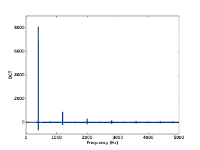

第六章：离散余弦变换
=========================

本章的主题是 **离散余弦变换（Discrete Cosine Transform， DCT）** ，
它在MP3和其他格式的音频文件压缩中经常使用，在图像和视频的压缩中也会用到。

DCT与频谱分解时用到的DFT很类似。学习了DCT之后可以更容易的理解DFT。

我们分几个步骤来学习DCT：

1. 先从合成信号开始：给定一组不同频率的余弦信号以及它们的幅值，构造一个合成的信号波形。

2. 使用Numpy来重写合成的函数，这样可以提升计算效率并且为下一步打好基础。

3. 分解信号：给定一个信号和每个频率分量，找到每个频率的幅值。我们先介绍一个简单直接的方法，
   但是比较慢。

4. 最后，我们使用一些线性代数的知识来改善计算效率。如果你有线性代数的基础是最好的，
   不过没有也没关系，我会把使用到的知识都简单介绍一下。

这章的代码 ``chap06.ipynb`` 可以在本书的 `代码库`_ 中找到，你也可以在 http://tinyurl.com/thinkdsp06 查看。

.. _代码库: https://github.com/AllenDowney/ThinkDSP

6.1 合成
-----------

给定一组余弦信号的频率和幅值，我们可以将它们相加来合成一个信号。
在 ``thinkdsp`` 模块中， 可以使用 ``synthesis`` 函数来完成这个操作::

    def synthesize1(amps, fs, ts):
        components = [thinkdsp.CosSignal(freq, amp)
                    for amp, freq in zip(amps, fs)]
        signal = thinkdsp.SumSignal(*components)

        ys = signal.evaluate(ts)
        return ys

其中 ``amps`` 是幅值， ``fs`` 是对应的频率值， ``ts`` 是用于计算波形的时间序列。

``components`` 是一组由给定幅值和频率构造的余弦信号， ``SumSignal`` 计算出来这些信号的和。

最后，使用 ``evaluate`` 计算出了 ``ts`` 的信号波形。

可以像下面这样来测试这个函数::

    amps = np.array([0.6, 0.25, 0.1, 0.05])
    fs = [100, 200, 300, 400]
    framerate = 11025

    ts = np.linspace(0, 1, framerate)
    ys = synthesize1(amps, fs, ts)
    wave = thinkdsp.Wave(ys, framerate)

这个例子中，合成信号的频率成分为100Hz的基频和三个谐波频率（100Hz相当于G♯2）。
然后使用合成的信号在11025Hz采样率下生产了波形对象。

虽然像这样合成信号是非常简单的，但是对我们 **分解信号** 没有什么帮助。
分解信号就是合成的逆操作：给定一个信号，将它分解成不同频率和幅值的余弦信号。

6.2 使用Numpy数组的合成
-------------------------

合成信号的另一个方式是这样::

    def synthesize2(amps, fs, ts):
        args = np.outer(ts, fs)
        M = np.cos(PI2 * args)
        ys = np.dot(M, amps)
        return ys

这段代码看上去和之前的完全不同，但是它们实际上完成了相同的事情，
让我们看看它是怎么工作的：

1. ``np.outer`` 计算了 ``ts`` 与 ``fs`` 的 **外积（outer product）** 。
   外积的结果是一个n行m列的矩阵（n为ts的长度，m为fs的长度），其中的每个元素
   都是对应位置的时间和频率的乘积 *ft* 。

2. 将 ``args`` 乘以 :math:`2\pi` 并应用 ``np.cos`` 
   计算出了 :math:`\cos (2\pi ft)` 。也就是说 *M* 中的每一列都是一个频率分量
   在 ``ts`` 时间序列下的值。

3. ``np.dot`` 计算出了 ``M`` 与 ``amps`` 的点积，也就是将 ``amps`` 的每个值与
   ``M`` 中每行对应的值相乘并求和。这样就求出了每个时间的合成信号的值。

.. _图6.1:

.. figure:: images/thinkdsp035.png
    :alt: Synthesis with arrays
    :align: center

    图6.1： 使用Numpy数组的合成过程

`图6.1`_ 展示了这个计算的过程。 矩阵 *M* 的每一行对应了0~1s的时间序列， 
其中第n个元素对应的时间用 :math:`{t_n}` 表示；每一列对应了100~400Hz的频率序列，
其中第k个元素对应的频率用 :math:`{k_n}` 表示。

我使用了a,b,c,d来表示每一行的四个元素，这里可以得出： :math:`a = \cos [2\pi (100){t_n}]`

点积的结果 ``ys`` 的每个值对应了 *M* 的一行，记为 *e* ，它可以写成：

.. math::

    e = 0.6a + 0.25b + 0.1c + 0.05d

这样，我们就可以计算出 ``ys`` 的所有元素的值，也就是四个频率分量在各个不同时间点下的值与相应
的幅值乘积的和。这就是我们想要的合成结果。

我们可以比较一下两个版本的合成结果是否一致::

    ys1 = synthesize1(amps, fs, ts)
    ys2 = synthesize2(amps, fs, ts)
    max(abs(ys1 - ys2))

可以得出 ``ys1`` 和 ``ys2`` 最大的差值为 1e-13，这仅仅是浮点数的精度误差。

我们可以用线性代数的形式来描述这个计算过程，如下：

.. math::

    M = \cos (2\pi t \otimes f)\\
    y = Ma

这里 *a* 表示幅值的向量， *t* 表示时间向量， *f* 表示频率向量。 *⊗* 表示外积。

6.3 分解
-------------

现在我们开始来解决分解的问题。假设给你一个信号并且告诉你这个信号是一组余弦信号合成的。
怎么求出这些余弦信号的幅值呢？换句话说，就是给定 ``ys`` ``ts`` 和 ``fs`` ，求 ``amps`` 。

其实，第一步与合成信号是一样，我们先计算出 :math:`M = \cos (2\pi t \otimes f)\\` ，
然后就是找到 *a* 使得 :math:`y = Ma` ，也就是解这个线性方程。Numpy提供了 ``np.solve``
来解决这个问题，代码如下::

    def analyze1(ys, fs, ts):
        args = np.outer(ts, fs)
        M = np.cos(PI2 * args)
        amps = np.linalg.solve(M, ys)
        return amps

前两行和合成函数是一样，用 ``ts`` 和 ``ys`` 计算出了 ``M`` ，然后使用 ``np.linalg.solve``
计算出了 ``amps`` 。

但是这里其实有一个问题，通常解一个线性方程组，需要方程的数量（矩阵的行数）和
未知数的数目（矩阵的列数）相同，也就是说 ``M`` 应该是方阵。

但是这个例子中，我们只有四个频率，却有11025个采样时间点，也就是方程的数量比未知数的数量多。

通常情况下，如果 ``ys`` 包含的元素超过4个，我们不会只计算4个频率成分。但是在这个例子中，
我们已知了只有这4个频率成分，所有我们可以仅使用 ``ys`` 的4个值就可以算出 ``amps`` 。

简单起见，我们使用了 ``ys`` 的前四个采样值来运行 ``analyze1`` ，如下::

    n = len(fs)
    amps2 = analyze1(ys[:n], fs, ts[:n])

计算结果确为::

    [ 0.6   0.25  0.1   0.05 ]

这个计算方法虽然简单但是很慢，因为解线性方程组的时间复杂度为 :math:`O({n^3})` ，
*n* 为 *M* 的列数。
接下来我们来优化它。

6.4 正交矩阵
----------------

求解线性方程组的一个方法是对矩阵求逆。对于方阵 *M* 来说，逆矩阵表示为 :math:`{M^{ - 1}}`
使得 :math:`{M^{ - 1}}M = I` 。 :math:`I` 表示单位矩阵，它的对角线元素均为1，其他元素均为0 。

因此，为了求解方程 :math:`y = Ma` ，我们将等式两边同时左乘 :math:`{M^{ - 1}}` 得到：

.. math::

    {M^{ - 1}}y = {M^{ - 1}}Ma

将右式的 :math:`{M^{ - 1}}M` 用 :math:`I` 代替，得到：

.. math::

    {M^{ - 1}}y = Ia

因为任何向量左乘单位向量都等于其本身，所以：

.. math::

    {M^{ - 1}}y = a

也就是说，如果我们求出 :math:`{M^{ - 1}}` ，就可以使用一个简单的点积来计算出 *a* 。
这样的时间复杂度仅为 :math:`O({n^2})` ，比 :math:`O({n^3})` 要好很多。

但是矩阵求逆也比较慢，但是有一些特殊情况比较快的计算出结果。例如如果 *M* 是正交矩阵，
那么它的逆就是它的转置，记为 :math:`{M^T}` 。在Numpy中，转置是一个常量时间复杂度的操作，
因为它并没有实际去改变矩阵的元素的位置，而是生成了一个视图，在我们存取元素的时候，实际上
存取的是相应位置转置后的值。

再次强调一遍，正交矩阵的转置与逆相等， :math:`{M^T} = {M^{ - 1}}` ，
也就意味着 :math:`{M^T}M = I` 。我们可以使用这个特性来判断一个矩阵是否是正交的。

我们来看看 ``synthesize2`` 中的矩阵是不是正交的。在之前的例子中， *M* 有11025行，
我们需要使用一个更小的版本::

    def test1():
        amps = np.array([0.6, 0.25, 0.1, 0.05])
        N = 4.0
        time_unit = 0.001
        ts = np.arange(N) / N * time_unit
        max_freq = N / time_unit / 2
        fs = np.arange(N) / N * max_freq
        ys = synthesize2(amps, fs, ts)

``amps`` 是与之前一样的幅值向量。我们有4个频率成分，因此需要4个采样点就可以了，以保证 *M* 为方阵。

``ts`` 是从0到1个单位时间的采样时间点序列，这里我随便选了一个0.001s作为单位时间，实际上无论选择什么
样的单位时间，计算结果都是一样的。

我们在单位时间内采样了N个点，奈奎斯特频率应为 *N/单位时间/2* ，这里为2000Hz。 ``fs`` 为0~2000Hz的
频率序列。矩阵 *M* 的计算结果为::

    [[ 1.     1.     1.     1.   ]
    [ 1.     0.707  0.    -0.707]
    [ 1.     0.    -1.    -0.   ]
    [ 1.    -0.707 -0.     0.707]]

很容易发现，这个矩阵是对称的，也就是说在 (j,k) 位置上的元素与 (k,j) 位置上的元素是相等的，
也就是它的转置与自身相等： :math:`{M^T} = M` 。

但不幸的是，它不是正交的，因为 :math:`{M^T}M` 不是单位矩阵::

    [[ 4.  1. -0.  1.]
    [ 1.  2.  1. -0.]
    [-0.  1.  2.  1.]
    [ 1. -0.  1.  2.]]

6.5 DCT-IV
---------------

但是我们有好几种选择方法，可以使得选择 ``ts`` 和 ``fs`` 后的 *M* 是正交的，
因此也就形成了不同的DCT的计算方法。

其中一种方式是将 ``ts`` 和 ``fs`` 移动半个单位，被称作DCT-IV，“IV”表示罗马数字4，
因为它是8个DCT方法中的第四个。

更新后的代码如下::

    def test2():
        amps = np.array([0.6, 0.25, 0.1, 0.05])
        N = 4.0
        ts = (0.5 + np.arange(N)) / N
        fs = (0.5 + np.arange(N)) / 2
        ys = synthesize2(amps, fs, ts)
 
与之前的代码比较后，你会发现两个改动，一个在 ``ts`` 和 ``fs`` 上加了0.5的偏移，
二是去掉了 ``time_unit`` 从而简化了fs。

结果， *M* 等于::

    [[ 0.981  0.831  0.556  0.195]
    [ 0.831 -0.195 -0.981 -0.556]
    [ 0.556 -0.981  0.195  0.831]
    [ 0.195 -0.556  0.831 -0.981]]

:math:`{M^T}M` 等于::

    [[ 2.  0.  0.  0.]
    [ 0.  2. -0.  0.]
    [ 0. -0.  2. -0.]
    [ 0.  0. -0.  2.]]

由于浮点数精度的原因，其中一些非对焦元素的值被显示为了-0，可以把它当做0来看。
这个矩阵非常接近 :math:`2I` 了，也就意味着 *M* 几乎是正交的，只是多了2倍的因子。
这样已经足够满足我们的需求了。

由于 *M* 是对称且正交的，因此， *M* 的逆为 *M/2* ，我们可以由此把代码改写为::

    def analyze2(ys, fs, ts):
        args = np.outer(ts, fs)
        M = np.cos(PI2 * args)
        amps = np.dot(M, ys) / 2
        return amps

我们把 ``np.linalg.solve`` 换成了与 *M/2* 进行点积。

结合 ``test2`` 和 ``analyze2`` ，我们就实现了DCT-IV的计算::

    def dct_iv(ys):
        N = len(ys)
        ts = (0.5 + np.arange(N)) / N
        fs = (0.5 + np.arange(N)) / 2
        args = np.outer(ts, fs)
        M = np.cos(PI2 * args)
        amps = np.dot(M, ys) / 2
        return amps

``ys`` 是波形数据，我们不用给定 ``ts`` 和 ``fs`` ， ``dct_iv`` 会通过 ``ys``
的长度来自行计算 ``ts`` 和 ``fs`` 。

如果之前的推导正确，这个函数应该可以用来对给定的 ``ys`` 进行分解求出 ``amps`` 。
我们来对它进行一下测试::

    amps = np.array([0.6, 0.25, 0.1, 0.05])
    N = 4.0
    ts = (0.5 + np.arange(N)) / N
    fs = (0.5 + np.arange(N)) / 2
    ys = synthesize2(amps, fs, ts)
    amps2 = dct_iv(ys)
    max(abs(amps - amps2))

首先，我们预设了一组幅值 ``amps`` ，并计算出了 ``ts`` 和 ``fs`` ，
然后使用 ``synthesize2`` 计算出了合成信号，然后用 ``dct_iv`` 对合成信号进行分解，
得到 ``amps2`` 。最后，将 ``amps`` 与 ``amps2`` 比较，他们的最大差值仅为1e-16
（由浮点数精度导致），说明计算正确。

6.6 逆DCT
-------------

最后，我们注意到 ``analyze2`` 和 ``synthesize2`` 的代码几乎是一样的，唯一的区别在于
``analyze2`` 的结果除了2。因此，我们可以这样来计算DCT的逆运算::

    def inverse_dct_iv(amps):
        return dct_iv(amps) * 2

``inverse_dct_iv`` 其实就是信号的合成：它把输入幅值向量并输出合成信号 ``ys`` 。
我们可以像下面这样测试 ``inverse_dct_iv`` ::

    amps = [0.6, 0.25, 0.1, 0.05]
    ys = inverse_dct_iv(amps)
    amps2 = dct_iv(ys)
    max(abs(amps - amps2))

同样，结果最大的差值是1e-16。

6.7 DCT类
--------------

``thinkdsp`` 中提供了一个 ``Dct`` 类对DCT进行封装（类似于 ``Spectrum`` 类对FFT进行的封装）。
我们可以通过波形的 ``make_dct`` 来生成Dct对象::

    signal = thinkdsp.TriangleSignal(freq=400)
    wave = signal.make_wave(duration=1.0, framerate=10000)
    dct = wave.make_dct()
    dct.plot()

这个一个400Hz的三角波的DCT结果，见 `图6.2`_ 。DCT的结果可以是正值也可以是负值，
负值代表的是负的余弦，也就相当于移动了180°的相位。

.. _图6.2:

    图6.2： 400Hz的三角信号在10kHz采样率下的DCT变换

``make_dct`` 内部用的是DCT-II方法来计算DCT，在 ``scipy.fftpack`` 中提供这个方法::

    import scipy.fftpack

    # class Wave:
        def make_dct(self):
            N = len(self.ys)
            hs = scipy.fftpack.dct(self.ys, type=2)
            fs = (0.5 + np.arange(N)) / 2
            return Dct(hs, fs, self.framerate)

``dct`` 的结果保存在 ``hs`` 中，对应的频率值为 ``fs`` （见 `6.5 DCT-IV`_ ）。
然后使用它们和采样率来生成一个 ``Dct`` 对象。

``Dct`` 类也提供了 ``make_wave`` 方法来计算逆DCT，我们来测试一下::

    wave2 = dct.make_wave()
    max(abs(wave.ys-wave2.ys))

``wave`` 和 ``wave2`` 的 ``ys`` 差别也大概为1e-16（同样是浮点数误差）。

``make_wave`` 使用了 ``scipy.fftpack.idct`` ::

    # class Dct
    def make_wave(self):
        n = len(self.hs)
        ys = scipy.fftpack.idct(self.hs, type=2) / 2 / n
        return Wave(ys, framerate=self.framerate) 

逆DCT默认不会结果进行归一化，因此我们需要除以 *2N* 。

6.8 练习
--------------

下面练习的答案可以参考文件 ``chap06soln.ipynb`` 。

**练习1** 之前我说 ``analyze1`` 的时间复杂度是 :math:`O({n^3})` ，
而 ``analyze2`` 的时间复杂度为 :math:`O({n^2})` 。使用不同长度的信号作为输入，
运行这两个函数并计时，看看我这个说法对不对。提示：可以使用魔法命令 ``%timeit`` 
来计时。

如果你将运行时间和输入数据的长度画在一个对数坐标下，应该可以得到一条直线，对于
``analyze1`` 来说直线的斜率为3，而 ``analyze2`` 斜率为2。

用同样的方法测试 ``dct_iv`` 和 ``scipy.fftpack.dct`` 。

**练习2** DCT主要应用在音频和图像的压缩中。简单来说，基于DCT的压缩原理是：

1. 把长段的数据分段。

2. 计算每段的DCT。

3. 把幅值很小的频率成分去掉，保存剩下的频率和幅值。

4. 解压的时候，将频率和幅值进行逆DCT运算。

把这个算法实现一下，并应用到一段音乐或语音上，看看多少频率成分被去除后，解压后的
声音能够感觉到与原始声音有区别。

为了让这个方法更实用，我们需要存储稀疏矩阵（大部分的元素为0）。
Numpy提供了几种方法，参见 http://docs.scipy.org/doc/scipy/reference/sparse.html 。

**练习3** 本书的 `代码库`_ 中有一个 ``phase.ipynb`` 的文件，讨论了相位对于声音的感受的影响。
阅读并运行里面的代码，并找一个其他的录音进行试验。你能找到相位结构与声音感觉之间的关系吗？

