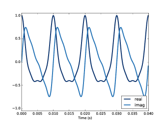
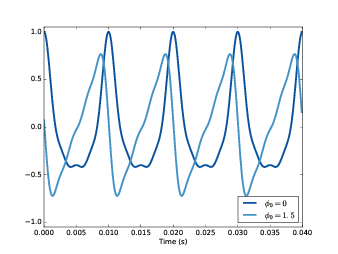
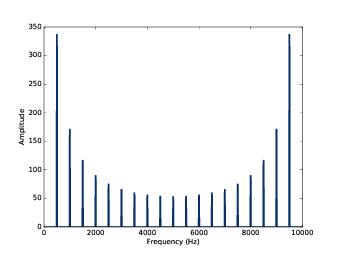

第七章：离散傅里叶变换
===========================

从第一章开始，我们就都在使用DFT来分析信号，但是我们还没有解释
它的工作原理，这章我们就来学习DFT的原理。

通过上一章，你应该理解了DCT的原理，这样理解DFT就很容易了。
它们之间唯一的区别在于DCT使用的是余弦函数，而DFT使用的是复指数函数。
像上一章一样，我会从复指数信号开始，一步一步的解释DFT：

1. 首先是合成问题：给定一组频率和幅值，构造它们的合成信号。
   合成问题其实就是DFT的逆运算。

2. 用矩阵形式重写合成算法。

3. 分解问题：给定一个信号，找到构成它的频率分量的幅值和初始相位，即DFT

4. 最后我们使用线性代数的知识来提高计算DFT的效率。

这章的代码 ``chap07.ipynb`` 可以在本书的 `代码库`_ 中找到，你也可以在 http://tinyurl.com/thinkdsp07 查看。

.. _代码库: https://github.com/AllenDowney/ThinkDSP

7.1 复指数
--------------

一直以来，推动数学发展的动力很多都来自于对公式的推广，就是将公式的适用范围扩大。
例如，我们通常定义的阶乘只能应用在正整数上。你一定很好奇，如何对一个小数进行阶乘，比如3.5。
由于之前的定义对小数不适用了，我们需要找另外的方法来计算小数的阶乘并且需要同样适用于整数。

1730年欧拉发现了一种在实数和复数域上扩展的阶乘，被称为伽玛函数。
（参见 http://en.wikipedia.org/wiki/Gamma_function）

欧拉还发现了很多类似的扩展数学定义的函数，复指数函数就是其中之一。

通常指数的定义是重复的乘以自身，
例如 :math:`{\varphi ^3} = \varphi  \cdot \varphi  \cdot \varphi` 。
但是定义不能应用在非整数指数上。

然后我们发现，指数可以表示成幂级数的形式：

.. math::

    {e^\varphi } = \;1\; + \;\varphi \; + \;{\varphi ^2}/2!\; + \;{\varphi ^3}/3!\; + \;...

这个定义就可以适用于任何实数，虚数以及复数了。如果我们使用一个纯虚数 :math:`i\varphi` 代入得到：

.. math::

    {e^{i\varphi }}\; = \;1\; + \;i\varphi \; - \;{\varphi ^2}/2!\; - \;i{\varphi ^3}/3!\; + \;...

对上式的各项重新排列后，我们可以发现它等价于：

.. math::

    {e^{i\varphi }}\; = \;cos\varphi \; + \;i\;sin\varphi

这个公式被称为欧拉公式，详见 http://en.wikipedia.org/wiki/Euler's_formula 
它意味着 :math:`{e^{i\varphi }}` 是一个模为1的复数，对应于复平面中单位圆上的一点，
而参数 :math:`\varphi` 就是这个点的向量与x轴（实轴）之间的夹角。

如果指数是一个复数的话，会得到：

.. math::

    {e^{a\; + \;i\varphi }}\; = \;{e^a}\;{e^{i\varphi }}\; = \;A\;{e^{i\varphi }}\;

这里 *A* 表示幅值， :math:`{e^{i\varphi }}` 是单位复指数，表示相角。

Numpy提供了 ``exp`` 方法来计算复指数::

    >>> phi = 1.5
    >>> z = np.exp(1j * phi)
    >>> z
    (0.0707+0.997j)

Python中使用 ``j`` 来表示单位虚数（就是上面使用的 *i* ）。一个以 ``j`` 结尾的数，表示了一个纯虚数，
例如， ``1j`` 其实就是 *i* 。

当 ``np.exp`` 的参数是虚数或者复数的时候，其结果是也是一个复数类型（ ``np.complex128`` ） ，
实际上就是两个分别代表实部和虚部的浮点数。这个例子中，结果为 ``0.0707+0.997j`` 。

复数有两个属性， ``real`` 和 ``imag`` ，分别代表它的实部和虚部::

    >>> z.real
    0.0707
    >>> z.imag
    0.997

可以使用Python内置的 ``abs`` 或是Numpy中的 ``np.absolute`` 来计算复数的模值::

    >>> abs(z)
    1.0
    >>> np.absolute(z)
    1.0

使用 ``np.angle`` 可以计算复数的相角::

    >>> np.angle(z)
    1.5
 
这个例子证明了 :math:`{e^{i\varphi }}` 确实是一个模为1，相角为1.5弧度的复数。

7.2 复信号
-------------

如果 :math:`\varphi (t)` 变成时间的函数，那么 :math:`{e^{i\varphi (t)}}` 也变成了时间的函数。
准确的说，可以写成：

.. math::

    {e^{i\varphi (t)}}\; = \;cos\varphi (t)\; + \;i\;sin\varphi (t)

这个式子描述了一个随时间变化的量，因此它是一个信号，准确的说叫做 **复指数信号** 。

这个例子中，信号的频率是一定的，如果把  :math:`\varphi (t) = 2\pi ft` ，那么：

.. math::

    {e^{i2\pi ft}}\; = \;cos2\pi ft + \;i\;sin2\pi ft

把初始相位 :math:`{\varphi _0}` 加入后得到：

.. math::

    {e^{i(2\pi ft + {\varphi _0})}}

``thinkdsp`` 中实现了复信号 - ``ComplexSinusoid`` ::

    class ComplexSinusoid(Sinusoid):
 
        def evaluate(self, ts):
                phases = PI2 * self.freq * ts + self.offset
                ys = self.amp * np.exp(1j * phases)
                return ys

``ComplexSinusoid`` 类继承了父类 ``Sinusoid`` 的构造函数，并复写了 ``evaluate`` 以计算信号的值，
它与 ``Sinusoid`` 相比只是用 ``np.exp`` 代替了 ``np.sin`` 。

一个复信号的值是复数的Numpy数组::

    >>> signal = thinkdsp.ComplexSinusoid(freq=1, amp=0.6, offset=1)
    >>> wave = signal.make_wave(duration=1, framerate=4)
    >>> wave.ys
    [ 0.324+0.505j -0.505+0.324j -0.324-0.505j  0.505-0.324j]

这个信号的频率是1Hz，幅值是0.6，初始相位是1弧度。例子中计算了从0~1s的四个采样点的值，
结果都是复数。

7.3 合成
---------------

与实的正弦信号一样，我们可以将不同频率和幅值的复信号加起来生成一个复合信号，
也就是复信号的合成问题：给定不同频率和幅值的复信号，计算合成信号。

最简单的方法就是生成 ``ComplexSinusoid`` 并把他们加起来::

    def synthesize1(amps, fs, ts):
        components = [thinkdsp.ComplexSinusoid(freq, amp)
                    for amp, freq in zip(amps, fs)]
        signal = thinkdsp.SumSignal(*components)
        ys = signal.evaluate(ts)
        return ys

这个函数与 :ref:`6.1 <6.1 合成>` 中的 ``synthesize1`` 函数几乎一样，
唯一的区别是把 ``CosSignal`` 换成了 ``ComplexSinusoid`` 。

下面是使用这个函数进行合成的例子::

    amps = np.array([0.6, 0.25, 0.1, 0.05])
    fs = [100, 200, 300, 400]
    framerate = 11025
    ts = np.linspace(0, 1, framerate)
    ys = synthesize1(amps, fs, ts)

结果为::

    [ 1.000 +0.000e+00j  0.995 +9.093e-02j  0.979 +1.803e-01j ...,
    0.979 -1.803e-01j  0.995 -9.093e-02j  1.000 -5.081e-15j]

看起来复信号就是一组复数值的序列，我们应该怎样来理解它呢？对于实数的信号，
我们可以很直观的理解为随时间变化的一个量，例如声音信号就是随时间变化的空气压力值。
然后，对于复信号，我们在现实中却找不到与之对应的物理量。

究竟什么是复信号？对于这个问题，我们还没有找到很直观的答案，但是有两种观点：

1. 复信号是对信号进行计算和分析时的一种数学抽象，在现实中不能直接对应于任何实际的信号。

2. 你可以把复信号想象为彼此独立的两个分别代表实部和虚部的实数信号。

按照第二种观点，我们可以把之前的复信号分解为实部和虚部两个信号::

     n = 500
    thinkplot.plot(ts[:n], ys[:n].real, label='real')
    thinkplot.plot(ts[:n], ys[:n].imag, label='imag')

如 `图7.1`_ ，实部是余弦信号的合成结果，虚部是正弦信号的合成结果。
虽然他们的波形看起来不一样，但是他们包含同样的频率成分，并且听起来也是一样的，
因为他们的频率成分仅仅相差了90°，而对于常值的相位差，我们人耳是分辨不出区别的。

.. _图7.1:

    图7.1： 复信号的实部和虚部

7.4 使用矩阵进行合成
----------------------

我们可以使用类似 :ref:`6.2 <6.2 使用Numpy数组的合成>` 的方法将之前的合成函数改写成矩阵的形式::

    PI2 = np.pi * 2

    def synthesize2(amps, fs, ts):
        args = np.outer(ts, fs)
        M = np.exp(1j * PI2 * args)
        ys = np.dot(M, amps)
        return ys

这里的 ``amps`` 是以Numpy数组保存的幅值序列。
``fs`` 是不同的频率成分， ``ts`` 是计算波形的采样时间序列。
``args`` 计算了 ``ts`` 和 ``fs`` 的点积，参见  :ref:`6.2 <6.2 使用Numpy数组的合成>` 。
``M`` 的每一列都是在某个频率的复指数信号在 ``ts`` 下采样的值。

把 ``M`` 与 ``amps`` 进行点积的结果就是不同频率的复指数信号在 ``ts`` 下的采样值之和，即我们想要的合成结果。

我们再来测试一下::

    >>> ys = synthesize2(amps, fs, ts)
    >>> ys
    [ 1.000 +0.000e+00j  0.995 +9.093e-02j  0.979 +1.803e-01j ...,
    0.979 -1.803e-01j  0.995 -9.093e-02j  1.000 -5.081e-15j]

这与上一节的结果是一样。

这个例子中，幅值是实数。实际上，幅值也可以是复数。复数的幅值是什么效果呢？记得我们之前所说的，
一个复数可以是一个实数加一个虚数，也可以是一个实数乘以一个复指数，这样一来，复数的幅值就可以
表示成：

.. math::

    A{e^{i{\varphi _0}}} \cdot {e^{i2\pi ft}} = A{e^{i2\pi ft + {\varphi _0}}}

也就是说，复数 :math:`A{e^{i{\varphi _0}}}` 的幅值表示的是信号幅值为 *A* ，
初始相位为 :math:`{\varphi _0}`

为了验证这一结论，我们在之前的例子中加入了复数的幅值::

    phi = 1.5
    amps2 = amps * np.exp(1j * phi)
    ys2 = synthesize2(amps2, fs, ts)

    thinkplot.plot(ts[:n], ys.real[:n])
    thinkplot.plot(ts[:n], ys2.real[:n])

``amps`` 乘以 ``np.exp(1j * phi)`` 就得到了模为 ``amps`` 相角为 ``phi`` 的复数。
信号的波形如 `图7.2` 所示，因为加入了 :math:`{\varphi _0} = 1.5` 的初始相位，相当与
对每个频率分量都移动了大约半个周期。由于每个频率分量的周期都不一样，导致了每个分量移动的
时间长度也不一样，于是合成的信号波形也不一样了。

.. _图7.2:

    图7.2： 不同初始相位的复信号的实部

现在，我们有了一个可以处理复数幅值的合成函数，接下我们该学习信号的分解了。

7.5 分解
-------------

分解是合成的逆运算：给定一个信号的采样序列 *y* ，以及组成信号的不同分量的频率，
我们需要计算出这些分量的复数幅值 *a* 。

与 :ref:`6.3 <6.3 分解>` 一样，我们可以通过求解线性方程 :math:`Ma = y` 
来得到 *a* ::

    def analyze1(ys, fs, ts):
        args = np.outer(ts, fs)
        M = np.exp(1j * PI2 * args)
        amps = np.linalg.solve(M, ys)
        return amps

``analyze1`` 输入复数信号序列 ``ys`` ，以及一系列的频率 ``fs`` 和采样时间序列 ``ts`` ，
然后使用 ``np.linalg.solve`` 计算并返回了结果 ``amps`` 。

使用上一节合成的信号，我们可以测试这个 ``analyze1`` 运行的结果是否正确。
由于求解线性方程需要 ``M`` 为方阵，因此我们把 ``ys`` ``fs`` 和 ``ts`` 都设置为相同的长度，
都等于 ``fs`` 的长度，代码如下::

    >>> n = len(fs)
    >>> amps2 = analyze1(ys[:n], fs, ts[:n])
    >>> amps2
    [ 0.60+0.j  0.25-0.j  0.10+0.j  0.05-0.j]

可以看到，结果与之前的幅值是一致的（由于浮点数精度误差导致了有很小的虚数部分）。

7.6 高效的分解
----------------

不幸的是，解线性方程的过程很慢。对于DCT来说，我们通过选择 ``fs`` 和 ``ts`` 使得
``M`` 是正交矩阵来提高计算的速度，也就是 ``M`` 的逆与它的转置相同，利用矩阵乘法来
代替了解方程的过程。

这里对于DFT，我们也可以使用同样的手法，但是又稍有不同。由于 ``M`` 是复数矩阵，
因此我们希望它是 **酉矩阵（unitary）** 而非正交矩阵，即 ``M`` 的逆为它的共轭转置，
就是将 ``M`` 转置并将所有元素的虚数部分取相反数（复共轭）。
参见 http://en.wikipedia.org/wiki/Unitary_matrix 。

Numpy中提供了 ``conj`` 和 ``transpose`` 函数来完成复共轭和转置两个操作，
下面的代码计算了 *N=4* 的情况下的 ``M`` ::

    N = 4
    ts = np.arange(N) / N
    fs = np.arange(N)
    args = np.outer(ts, fs)
    M = np.exp(1j * PI2 * args)

如果 *M* 是酉矩阵，那么根据酉矩阵的定义，我们可以得出 :math:`{M^ * }M = I` ，
这里的 :math:`{M^ * }` 表示 *M* 的共轭转置。我们可以利用这个性质来测试 *M*
是否是酉矩阵::

    MstarM = M.conj().transpose().dot(M)

不考虑浮点数精度误差的话，结果等于 *4I* ，也就是说 *M* 是有一个因子 *N* 的酉矩阵。
这与在DCT类似，那里的因子是2。

使用这个性质，我们将之前的算法改写为::

    def analyze2(ys, fs, ts):
        args = np.outer(ts, fs)
        M = np.exp(1j * PI2 * args)
        amps = M.conj().transpose().dot(ys) / N
        return amps

然后来测试一下::

    N = 4
    amps = np.array([0.6, 0.25, 0.1, 0.05])
    fs = np.arange(N)
    ts = np.arange(N) / N
    ys = synthesize2(amps, fs, ts)
    amps3 = analyze2(ys, fs, ts)

结果又一次证明了算法的正确性::

    [ 0.60+0.j  0.25+0.j  0.10-0.j  0.05-0.j]

7.7 DFT
------------

由于 ``analyze2`` 需要在特定的 ``ts`` 和 ``fs`` 下才能工作，
使用起来很不方便，于是我想把 ``ts`` ``fs`` 的选择过程放到函数里面，
重写为仅仅输入 ``ys`` 就可以自己计算 ``ts`` 和 ``fs`` 并得到结果。

首先，我定义了一个计算矩阵 *M* 的函数::

    def synthesis_matrix(N):
        ts = np.arange(N) / N
        fs = np.arange(N)
        args = np.outer(ts, fs)
        M = np.exp(1j * PI2 * args)
        return M

然后实现了这个 ``analyze3`` ::

    def analyze3(ys):
        N = len(ys)
        M = synthesis_matrix(N)
        amps = M.conj().transpose().dot(ys) / N
        return amps

``analyze3`` 和DFT已经很接近了，唯一的区别是通常DFT的定义中不会除以 *N* ::

    def dft(ys):
        N = len(ys)
        M = synthesis_matrix(N)
        amps = M.conj().transpose().dot(ys)
        return amps

现在，我们可以用这个函数与Numpy中的 ``np.fft`` 进行对比测试::

    >>> dft(ys)
    [ 2.4+0.j  1.0+0.j  0.4-0.j  0.2-0.j]

结果等于 ``amps*N`` 。下面是使用 ``np.fft`` 计算的结果::

    >>> np.fft.fft(ys)
    [ 2.4+0.j  1.0+0.j  0.4-0.j  0.2-0.j]

它们的结果是相同的。

逆DFT基本上也是一样的道理，只是不是对 *M* 进行共轭转置。
而且，由于之前没有除以 *N* ，这里就需要把除以 *N* 加上::

    def idft(ys):
        N = len(ys)
        M = synthesis_matrix(N)
        amps = M.dot(ys) / N
        return amps

最后，我们来把这两个函数联合起来测试一下，确保 ``dft(idft(amps))`` 的结果为 ``amps`` ::

    >>> ys = idft(amps)
    >>> dft(ys)
    [ 0.60+0.j  0.25+0.j  0.10-0.j  0.05-0.j]

如果回到以前让我来定义DFT的话，我宁愿把除以 *N* 加在DFT的定义中，而逆DFT中不加，
那样与我们解释的原理更一致些。或者两个定义里面都除以 :math:`\sqrt N` ，
这样DFT和IDFT的形式就更一致了。当时可惜那是不可能的，因此这里我沿用了
最常规的DFT定义，虽然在形式上有点奇怪，但是并不影响我们使用。

7.8 DFT的周期性
------------------

上一节中我们将DFT表示成了矩阵乘法：先计算矩阵 *M* 然后计算它的酉矩阵 :math:`{M^ * }` ，
然后将它与信号 ``y`` 相乘。这一系列的步骤，如果展开来看的话，可以写成：

.. math::

    DFT(y)[k] = \sum\limits_{n = 0}^{N - 1} {y[n]{e^{ - 2\pi ink/N}}}

这里的 *k* 是频率分量的序号0~N-1， *n* 是采样时间序列的序号，同样也是0~N-1.
*DFT(y)[k]* 就是对y进行DFT结果的第 *k* 个值。

通常我们只需计算k为0~N-1的值就可以了，因为之后的值都是循环重复的，即第 *k* 个值
与第 *k+N* 个值是相同的，同样与 *k+2N* 和 *k-N* 的值也是相同的。

为了证明这一点，我们可以把 *k+N* 代入上式中：

.. math::

    DFT(y)[k + N] = \sum\limits_{n = 0}^{N - 1} {y[n]{e^{ - 2\pi in(k + N)/N}}}

于是可以分解为：

.. math::

    DFT(y)[k + N] = \sum\limits_{n = 0}^{N - 1} {y[n]{e^{ - 2\pi ink/N}}} {e^{ - 2\pi inN/N}}

上式中最后一项，指数均为 :math:`{2\pi }` 的整数倍，因此它恒等于1，于是：

.. math::

    DFT(y)[k + N] = \sum\limits_{n = 0}^{N - 1} {y[n]{e^{ - 2\pi ink/N}}} 

可以看到，这个式子就等于 *DFT(y)[k]* 。因此，我们说DFT是周期性的，它的周期是 *N* 。
在本章后面的练习中会让你实现快速傅立叶变换算法（FFT），那里就要用到这个性质。

值得一提的是，将DFT写成上面的和式的形式，可以帮助我们加深对它的理解。
我们回过头来看 :ref:`6.2 <6.2 合成>` 中的框图，你会发现合成矩阵 *M* 中的每一列
都是不同频率的信号在一个采样时间序列下的值。而分解矩阵就是 *M* 的共轭转置，
它的每行代表了一个信号在一个采样时间序列下的值。

因此，和式正好是信号 ``y`` 与一个复指数信号的互相关，也就是说DFT的每一个元素代表了
信号 ``y`` 与不同频率的复指数信号的相关性。

7.9 实信号的DFT
-------------------

``thinkdsp`` 中的频谱类使用了 ``np.fft.rfft`` 来进行DFT计算，它实际上做的就是实信号的DFT，
也就是说它仅可以处理值为实数的信号。前面我们讲到的DFT都是针对复数信号的（完整DFT），
那么当我们使用完整DFT来计算实信号的DFT的时候，会怎么样呢？我们来看一个例子::

    signal = thinkdsp.SawtoothSignal(freq=500)
    wave = signal.make_wave(duration=0.1, framerate=10000)
    hs = dft(wave.ys)
    amps = np.absolute(hs)

这里我们产生了一个500Hz的锯齿波信号，采样率为10kHz。 ``hs`` 计算了波形的完整DFT，
结果为 ``amps`` ，它包含了每个频率成分的幅值。但是这些幅值对应的频率究竟是多少呢？
从 ``dft`` 的实现上，我们可以看到::

    fs = np.arange(N)

由于 ``dft`` 并不知道实际的采样率是多少，因此 ``fs`` 并不能代表实际的频率值。
实际上，``dft`` 中假设波形是在1个单位时间内产生的，因此采样率是 *N/单位时间* ，
为了得到频率值，我们需要将单位时间转换为秒::

    fs = np.arange(N) * framerate / N

这样转换之后，我们得到了从0到10kHz（采样率）的频率值，我们将它画成频谱图::

    thinkplot.plot(fs, amps)
    thinkplot.config(xlabel='frequency (Hz)', 
                     ylabel='amplitude')
 
如 `图7.3`_ ，左半部分就是我们希望的结果：基频在500Hz，然后谐波分量的幅值
以 *1/f* 的速度逐渐衰减。

但是图的右半部分却很奇怪，从5000Hz开始，谐波的幅值开始逐渐增大，
直到9500Hz达到峰值。这个为什么呢？

.. _图7.3:

    图7.3： 500Hz锯齿信号在10kHz采样率下的DFT结果

答案是混叠。在 :ref:`2.3 混叠` 中，我们说过10000Hz的采样率，折叠频率是5000Hz，
这种情况下，5500Hz的频率和4500Hz的频率在采样后是没有区别的。当我们计算在5500Hz
频率下的DFT的时候，就会得到与4500Hz下相同的结果。同样的道理，6000Hz和4000Hz等
也是一样的。
也就是说，实信号的DFT是相对于折叠频率对称的。因此，我们仅计算一半的值就可以了，
这样可以节省一半的时间， ``np.fft.rfft`` 就是这样做的。

.. admonition:: 译者注

    译者认为用混叠来解释对称的现象并不合适。在实际使用DFT的时候，我们通常并不会
    选择频率范围为0~采样率，而是选择 -折叠频率 ~ +折叠频率。引入了负频率之后，
    容易证明，正负两个复为相反数的频率的信号之和为实数的条件是，他们的幅值（复数）
    应该是共轭的，就是模相等，相角互为相反数。因此，DFT后幅值是偶对称，而初始相位
    是奇对称的。

7.10 练习
-----------------

下面练习的答案可以参考文件 ``chap07soln.ipynb`` 。
    
**练习1** ``chap07.ipynb`` 中包含了一些额外的实例和说明，阅读并运行这些代码。

**练习2** 本章中我解释了使用矩阵乘法来进行DFT以及IDFT的方法。
这种算法的时间复杂度是 :math:`O({n^2})` ， *n* 为波形的长度。虽然在某些情况下，
这个速度以及足够快了，但是其实还有一个更快的算法，就是快速傅立叶变换（FFT）算法。
FFT的时间复杂度是 :math:`O(n\log n)` 。FFT算法的关键是Danielson-Lanczos定理：

.. math::

    DFT(y)[n] = DFT(e)[n] + {e^{ - 2\pi in/N}}DFT({\rm{o}})[n]

上式中， *DFT(y)[n]* 表示 *y* 的DFT的第n个元素值， *e* 表示 *y* 中偶数位置上的
元素， *o* 表示 *y* 中奇数位置上的元素。
这个定理表明，DFT可以分解为奇偶两个部分的DFT计算（分治），这样就可以递归的来计算
整个DFT：

1. 给定波形 ``y`` ，将其分成奇偶两个部分 ``e`` 和 ``o`` 。

2. 递归的计算 ``e`` 和 ``o`` 的DFT。

3. 根据上式把两项相加得到最后的DFT结果。

递归的结束条件可以是波形的长度为1的时候，这个时候 *DFT(y)=y* 。
也可以选择在长度很小的时候结束，通过矩阵乘法来计算最后这个DFT结果。

提示：我建议你从一个非递归的版本开始一步步的来实现这个算法，在上面的第2步，
用 ``dft`` （ `7.7 DFT`_ ） 或 ``np.fft.fft`` 来代替递归调用。然后，确保
第三步的结果是正确的。然后把递归的结束条件加上，并将第2步替换成递归调用。

提示：记住DFT是周期性的，你会发现 ``np.tile`` 是很有用的。

关于FFT的更多知识，可以参考 https://en.wikipedia.org/wiki/Fast_Fourier_transform 。

