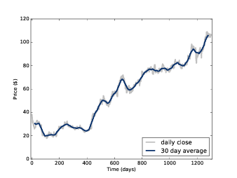

第八章：滤波和卷积
=======================

本章我会介绍信号处理中的一个重要的概念-卷积定理（Convolution Theorem）。
不过在这之前，我们需要先了解一下卷积这个概念。
这里，我们先以一个简单的平滑作为例子开始我们的学习。

这章的代码 ``chap08.ipynb`` 可以在本书的 `代码库`_ 中找到，你也可以在 http://tinyurl.com/thinkdsp08 查看。

.. _代码库: https://github.com/AllenDowney/ThinkDSP

8.1 平滑
-------------

平滑是一种试图消除信号短期的变化的操作，信号经过平滑操作后，可以更好的
揭示长期的变化趋势。例如，如果把股票的每日价格变化画出来，它会看起来像噪声一样，
但是经过平滑之后，我们就可以比较清楚的看到他是上升的趋势还是下降的趋势了。

一个最普通的平滑操作就是移动平均法。它将信号之前 *n* 个时刻的值的平均值作为
新的信号的第 *n* 个值。

.. _图8.1:

    图8.1： Fackbook股票的日线和30日平均线

例如， `图8.1`_ 展示了Fackbook的股票从2012年5月17日到2015年11月8日的每日收盘价格曲线。灰色的曲线代表原始数据，
而蓝色的曲线则是进行了30日移动平均之后的数据。可见，平滑后，信号的短期变化被很大程度的消除了，
这样一来我们也就更容易的看出数据的长期变化趋势。

平滑操作也能用于声音信号。我们先从一个440Hz的方波信号为例，如 :ref:`2.2 <2.2 方波>` 中所述，方波的谐波衰减的
比较慢，它包含很多高频的成分。

我们先生成一个方波信号和它的两段波形::

    signal = thinkdsp.SquareSignal(freq=440)
    wave = signal.make_wave(duration=1, framerate=44100)
    segment = wave.segment(duration=0.01)

``wave`` 是1s的波形， ``segment`` 是一个较短的波形（0.01s），我会用它来作图。

为了计算信号移动平均值，我会使用一个类似 :ref:`3.7 <3.7 窗函数>` 的窗口。在那一章，我们使用了汉明窗来避免
因为信号前后不连续引起的频谱泄露。这里，我们使用窗函数来计算一段信号的加权和。

上例中，我们可以通过一个包含相等且和为1的11个元素的窗，来计算移动平均::

    window = np.ones(11)
    window /= sum(window)

然后将这个窗应用到波形上::

    ys = segment.ys
    N = len(ys)
    padded = thinkdsp.zero_pad(window, N)
    prod = padded * ys
    sum(prod)

``padded`` 将窗函数尾部添加0来保证其长度与 ``segment.ys`` 一致。这种补0的方法，称为 **padding** 。

``prod`` 是波形数据与窗函数的乘积， 他们的和其实就是窗口内前11个元素的平均值。
我们需要把窗口滚动到下一个位置。这个例子中，前11个元素都是-1，因此平均值也是-1。

为了计算移动平均的下一个值，我们需要将窗口向右移动一个位置，然后再进行同样的计算::

    rolled = np.roll(rolled, 1)
    prod = rolled * ys
    sum(prod)

使用同样的方法，我们可以计算剩余的所有元素，下面的代码将之前的代码都放到了一个循环中，
这样它就可以循环的处理整段信号并把结果放入了数组中::

    def smooth(ys, window):
        N = len(ys)
        smoothed = np.zeros(N)
        padded = thinkdsp.zero_pad(window, N)
        rolled = padded

        for i in range(N):
            smoothed[i] = sum(rolled * ys)
            rolled = np.roll(rolled, 1)
        return smoothed

``smooth`` 就是用来保存结果的数组， ``padded`` 就是补0后的窗函数， ``rolled`` 是 ``padded``
的一份拷贝，它在每次循环结束后都会右移一个元素。在循环内，我们将 ``ys`` 和 ``rolled`` 相乘并求和，
然后依次放入 ``smooth`` 数组中。

结果见 `图8.2`_ ，其中灰线是原始信号，蓝线是平滑后的信号。可见，平滑后的信号在原始信号突变的时候
是以斜坡的方式变化的，也就是信号的变化没有那么“尖锐”了。

.. _图8.2:

    图8.2： 440Hz方波信号（灰线）和11元素的移动平均信号（蓝线）

8.2 卷积
--------------

上一节中，我们运用窗函数对信号逐段进行的操作就叫做 **卷积（convolution）**

卷积是一个经常使用的操作，Numpy中提供了一个更加简单和快速的实现::

    convolved = np.convolve(ys, window, mode='valid')
    smooth2 = thinkdsp.Wave(convolved, framerate=wave.framerate)

``np.convolve`` 计算了波形和窗函数的卷积。参数 ``valid`` 表示只计算窗函数和波形
完全重叠没有交叉的部分，因此它从窗函数与波形数据左对齐开始，直到窗口移动到与波形右对齐。
计算结果与 `图8.2`_ 是完全相同的。

严格的来说，之前的代码和它还是有一定的区别，之前的代码计算的是互相关函数：

.. math::

    (f \star g)[n] = \sum\limits_{m = 0}^{N - 1} {f[m]g[n + m]} 

这里 *f* 代表了长度为 *N* 的波形数据， *g* 是窗函数， *⋆* 是互相关的算符。
当计算第n个值的时候，实际上我们需要将 *g* 右移 *n* 个位置，这也是 *g[n+m]* 的意义。

而卷积的定义是：

.. math::

    (f * g)[n] = \sum\limits_{m = 0}^{N - 1} {f[m]g[n - m]} 

:math:`*` 是卷积算符，这个式子与之前那个的区别在于 *g* 的 *m* 是负的，
也就是 *g* 的值是反过来的，计算的时候也应该反过来。由于上一个例子中，
窗函数是对称的，因此它们的结果才会一样。如果使用其他的窗函数，就必须要注意这一点。

为什么要像这样来定义卷积呢？有两个原因：

* 这个定义在很多场合下都是很自然而然的得出来的，尤其是在分析信号处理系统的时候，
    我们会在第十章的时候学习。

* 这个定义是卷积定理的基础，我们马上就会学习。

之后我们还会学习到圆周卷积。

8.3 频域
---------------

