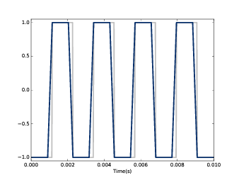
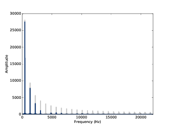
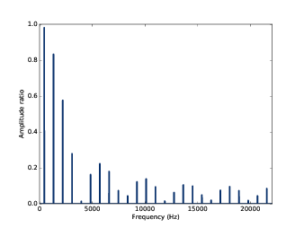
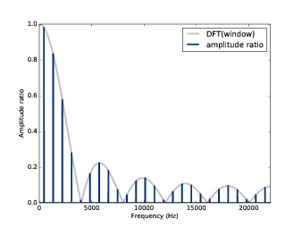
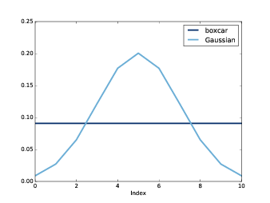
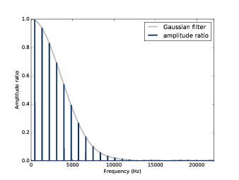
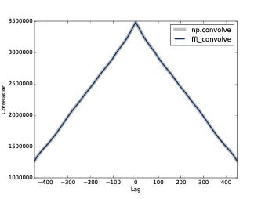

第八章：滤波和卷积
=======================

本章我会介绍信号处理中的一个重要的概念-卷积定理（Convolution Theorem）。
不过在这之前，我们需要先了解一下卷积这个概念。
这里，我们先以一个简单的平滑作为例子开始我们的学习。

这章的代码 ``chap08.ipynb`` 可以在本书的 `代码库`_ 中找到，你也可以在 http://tinyurl.com/thinkdsp08 查看。

.. _代码库: https://github.com/AllenDowney/ThinkDSP

8.1 平滑
-------------

平滑是一种试图消除信号短期的变化的操作，信号经过平滑操作后，可以更好的
揭示长期的变化趋势。例如，如果把股票的每日价格变化画出来，它会看起来像噪声一样，
但是经过平滑之后，我们就可以比较清楚的看到他是上升的趋势还是下降的趋势了。

一个最普通的平滑操作就是移动平均法。它将信号之前 *n* 个时刻的值的平均值作为
新的信号的第 *n* 个值。

.. _图8.1:

.. figure:: images/thinkdsp040.png
    :alt: Daily closing price of Facebook stock and a 30-day moving average
    :align: center

    图8.1： Fackbook股票的日线和30日平均线

例如， `图8.1`_ 展示了Fackbook的股票从2012年5月17日到2015年11月8日的每日收盘价格曲线。灰色的曲线代表原始数据，
而蓝色的曲线则是进行了30日移动平均之后的数据。可见，平滑后，信号的短期变化被很大程度的消除了，
这样一来我们也就更容易的看出数据的长期变化趋势。

平滑操作也能用于声音信号。我们先从一个440Hz的方波信号为例，如 :ref:`2.2 <2.2 方波>` 中所述，方波的谐波衰减的
比较慢，它包含很多高频的成分。

我们先生成一个方波信号和它的两段波形::

    signal = thinkdsp.SquareSignal(freq=440)
    wave = signal.make_wave(duration=1, framerate=44100)
    segment = wave.segment(duration=0.01)

``wave`` 是1s的波形， ``segment`` 是一个较短的波形（0.01s），我会用它来作图。

为了计算信号移动平均值，我会使用一个类似 :ref:`3.7 <3.7 窗函数>` 的窗口。在那一章，我们使用了汉明窗来避免
因为信号前后不连续引起的频谱泄露。这里，我们使用窗函数来计算一段信号的加权和。

上例中，我们可以通过一个包含相等且和为1的11个元素的窗，来计算移动平均::

    window = np.ones(11)
    window /= sum(window)

然后将这个窗应用到波形上::

    ys = segment.ys
    N = len(ys)
    padded = thinkdsp.zero_pad(window, N)
    prod = padded * ys
    sum(prod)

``padded`` 将窗函数尾部添加0来保证其长度与 ``segment.ys`` 一致。这种补0的方法，称为 **padding** 。

``prod`` 是波形数据与窗函数的乘积， 他们的和其实就是窗口内前11个元素的平均值。
我们需要把窗口滚动到下一个位置。这个例子中，前11个元素都是-1，因此平均值也是-1。

为了计算移动平均的下一个值，我们需要将窗口向右移动一个位置，然后再进行同样的计算::

    rolled = np.roll(rolled, 1)
    prod = rolled * ys
    sum(prod)

使用同样的方法，我们可以计算剩余的所有元素，下面的代码将之前的代码都放到了一个循环中，
这样它就可以循环的处理整段信号并把结果放入了数组中::

    def smooth(ys, window):
        N = len(ys)
        smoothed = np.zeros(N)
        padded = thinkdsp.zero_pad(window, N)
        rolled = padded

        for i in range(N):
            smoothed[i] = sum(rolled * ys)
            rolled = np.roll(rolled, 1)
        return smoothed

``smooth`` 就是用来保存结果的数组， ``padded`` 就是补0后的窗函数， ``rolled`` 是 ``padded``
的一份拷贝，它在每次循环结束后都会右移一个元素。在循环内，我们将 ``ys`` 和 ``rolled`` 相乘并求和，
然后依次放入 ``smooth`` 数组中。

结果见 `图8.2`_ ，其中灰线是原始信号，蓝线是平滑后的信号。可见，平滑后的信号在原始信号突变的时候
是以斜坡的方式变化的，也就是信号的变化没有那么“尖锐”了。

.. _图8.2:

    图8.2： 440Hz方波信号（灰线）和11元素的移动平均信号（蓝线）

8.2 卷积
--------------

上一节中，我们运用窗函数对信号逐段进行的操作就叫做 **卷积（convolution）**

卷积是一个经常使用的操作，Numpy中提供了一个更加简单和快速的实现::

    convolved = np.convolve(ys, window, mode='valid')
    smooth2 = thinkdsp.Wave(convolved, framerate=wave.framerate)

``np.convolve`` 计算了波形和窗函数的卷积。参数 ``valid`` 表示只计算窗函数和波形
完全重叠没有交叉的部分，因此它从窗函数与波形数据左对齐开始，直到窗口移动到与波形右对齐。
计算结果与 `图8.2`_ 是完全相同的。

严格的来说，之前的代码和它还是有一定的区别，之前的代码计算的是互相关函数：

.. math::

    (f \star g)[n] = \sum\limits_{m = 0}^{N - 1} {f[m]g[n + m]} 

这里 *f* 代表了长度为 *N* 的波形数据， *g* 是窗函数， *⋆* 是互相关的算符。
当计算第n个值的时候，实际上我们需要将 *g* 右移 *n* 个位置，这也是 *g[n+m]* 的意义。

而卷积的定义是：

.. math::

    (f * g)[n] = \sum\limits_{m = 0}^{N - 1} {f[m]g[n - m]} 

:math:`*` 是卷积算符，这个式子与之前那个的区别在于 *g* 的 *m* 是负的，
也就是 *g* 的值是反过来的，计算的时候也应该反过来。由于上一个例子中，
窗函数是对称的，因此它们的结果才会一样。如果使用其他的窗函数，就必须要注意这一点。

为什么要像这样来定义卷积呢？有两个原因：

* 这个定义在很多场合下都是很自然而然的得出来的，尤其是在分析信号处理系统的时候，
    我们会在第十章的时候学习。

* 这个定义是卷积定理的基础，我们马上就会学习。

之后我们还会学习到圆周卷积。

8.3 频域
---------------

在时域上，平滑操作会使信号的变化没有那么剧烈，那么在频域上，有什么变化呢？
让我们先来看看原始信号的频谱::

    spectrum = wave.make_spectrum()
    spectrum.plot(color=GRAY)

再来看看平滑后的信号频谱::

    convolved = np.convolve(wave.ys, window, mode='same')
    smooth = thinkdsp.Wave(convolved, framerate=wave.framerate)
    spectrum2 = smooth.make_spectrum()
    spectrum2.plot()

``same`` 模式表示计算结果需要和输入的长度一致。虽然，这样会产生一些不太好的值，
不过不会应该我们之后的分析。

如 `图8.3`_ 所示，基频的幅值几乎没有变化，而接下来几个谐波分量的幅值都有所衰减。
再往高频的分量就几乎被消除了。因此，平滑操作具有低通滤波的效果，见 :ref:`1.5 频谱`
以及 :ref:`4.4 粉红噪声` 。

.. _图8.3:

    图8.3： 方波平滑前（灰色）和平滑后（蓝色）的频谱图

为了知道各个频率成分衰减的程度，我们计算出了两个频谱分量的比例::

    amps = spectrum.amps
    amps2 = spectrum2.amps
    ratio = amps2 / amps    
    ratio[amps<560] = 0
    thinkplot.plot(ratio)

``ratio`` 就是平滑前和平滑后的幅值比例。 当 ``amps`` 很小的时候，这个比例会很大并且没什么意义，
因此我们简单的把它设置为了0 。

.. _图8.4:

    图8.4： 方波平滑前（灰色）和平滑后（蓝色）的幅值比例

如 `图8.4`_ ，在低频的时候 ``ratio`` 是比较大的，接近1，然后逐渐减小直到截止频率4000Hz。
但是，在4000Hz之后， ``ratio`` 又开始在0~0.2之间变动，这是怎么回事呢？

8.4 卷积定理
--------------

答案就是卷积定理，它的数据公式如下：

.. math::

    DFT(f * g) = DFT(f) \cdot DFT(g)

式中， *f* 是波形数据， *g* 是窗函数，也就是说根据卷积定理， *f* 与 *g* 的卷积后的信号的DFT，
与它们分别进行DFT然后再相乘的结果是一样的。

由于波形是随时间变化的函数，因此卷积操作是在 **时域（time domain）** 上进行的。
而DFT后相乘是在 **频域（frequency domain）** 进行的，因为DFT的结果是频率的函数。
因此，我们又可以这样来描述卷积定理：

* 时域的卷积相当于频域的乘积

这也解释了 `图8.4`_ 的结果。当我们把波形和窗函数进行卷积，实际在频域上就是波形的频谱和窗函数频谱的
乘积。为了证明这一点，我们先计算出了窗函数的DFT::

    padded = zero_pad(window, N)
    dft_window = np.fft.rfft(padded)
    thinkplot.plot(abs(dft_window))

``padded`` 是补0后的窗函数， ``dft_window`` 是窗函数的DFT。

.. _图8.5:

        along with the DFT of the smoothing window
    :align: center

    图8.5： 方波平滑前和平滑后的幅值比例以及窗函数的DFT结果

结果见 `图8.5`_ ，平滑前后的幅值比例与窗函数的DFT结果 ``dft_window`` 是完全重合的。
用数学公式表示是：

.. math::

    |DFT(f*g)|/|DFT(f)| = |DFT(g)|

在频域下，窗函数的DFT就称为 **滤波器（filter）** ，也就是说时域上一个窗函数的卷积，就对应了
频域下的一个滤波器。

8.5 高斯滤波器
-----------------

上一节使用的移动平均窗是一个低通滤波器，但是滤波的效果并不是很好。因为它的DFT一开始衰减的很快，
但是后面开始上下震荡，这种情况被称为 **旁瓣（sidelobes）** 。由于移动平均窗实际上是一个方波
信号，它的频谱上包含高频的谐波成分并且幅值是按照 *1/f* 衰减的，这就比较慢了。

而高斯窗函数就比较好了。Scipy中提供了很多常用的卷积窗函数，其中就包括高斯窗::

    gaussian = scipy.signal.gaussian(M=11, std=2)
    gaussian /= sum(gaussian)

这里， ``M`` 是窗的长度， ``std`` 是高斯分布函数的标准差参数。 `图8.6`_ 展示了这个窗函数的形状，
它是高斯分布钟型曲线的离散化，图中还画出了移动平均窗的曲线，实际上就是一条平的直线，由于看起来像是
矩形，因此又称为矩形窗。

.. _图8.6:

    图8.6： 高斯窗函数

我用高斯窗函数重新进行了一次和上一节相同的计算，结果如 `图8.7`_ ，可见通过高斯窗进行平滑后的
频谱衰减比例与高斯窗的DFT是一致的。

.. _图8.7:

    图8.7： 经过高斯窗平滑前后的频谱比例与窗函数的DFT结果

对于低通滤波的效果来说，高斯平滑要比移动平均要更好一些。图中，随着幅值的衰减，几乎没有旁瓣出现，因此它
可以更好的去除信号的高频成分。

我们之前提到过，高斯函数的DFT也是高斯函数，它的频谱是以 :math:`{e^{ - {f^2}}}` 衰减的，因此，它比 *1/f*
的矩形窗要好很多。

8.6 高效的卷积
--------------------

FFT的一个重要的运用是，它与卷积定理结合起来可以提供一种高效的计算卷积，互相关和自相关函数的方法。

这里，我们重新写一次卷积定理的公式：

.. math::

    DFT(f * g) = DFT(f) \cdot DFT(g)

因此，我们得到一种计算卷积的方法：

.. math::

    f*g = IDFT(DFT(f) \cdot DFT(g))

``IDFT`` 指的是逆DFT变换。我们之前使用的卷积计算方式，时间复杂度是 :math:`O({n^2})` ；
而使用这种方式，时间复杂度仅为 :math:`O(n\log n)` 。

为了验证这种方式的正确性，我们将分别使用两种方法来计算 `图8.1`_ 中Fackbook股票数据的卷积结果::

    import pandas as pd

    names = ['date', 'open', 'high', 'low', 'close', 'volume']
    df = pd.read_csv('fb.csv', header=0, names=names)
    ys = df.close.values[::-1]

上面的代码中使用了Pandas来从csv文件中读取数据，这个文件包含在 `代码库`_ 中。
Pandas是一个数据处理库，本书中涉及的不多，因此即使你不太熟悉也没关系。
如果有兴趣和话，可以阅读 Think Stats at http://thinkstats2.com 。

从csv读入的数据保存在 ``df`` 中，它是一个 ``DataFrame`` 对象（Pandas中的一个数据类），
``close`` 是包含收盘数据的Numpy数组。

接下来，我将高斯窗应用到了这个数据上::

    window = scipy.signal.gaussian(M=30, std=6)
    window /= window.sum()
    smoothed = np.convolve(ys, window, mode='valid')

下面的 ``fft_convolve`` 使用FFT来进行卷积::

    from np.fft import fft, ifft

    def fft_convolve(signal, window):
        fft_signal = fft(signal)
        fft_window = fft(window)
        return ifft(fft_signal * fft_window)

我们将同样的高斯窗补0后，使用 ``fft_convolve`` 来进行同样的计算::

    padded = zero_pad(window, N)
    smoothed2 = fft_convolve(ys, padded)

``smooth2`` 的开头包含 *M-1* 个无效的数据， *M* 是窗长度，我们可以像下面这样来去掉这些数据::

    M = len(window)
    smoothed2 = smoothed2[M-1:]

经过比较， ``fft_convolve`` 和 ``np.convolve`` 的结果是相同的。

8.7 高效的自相关
------------------

在 `8.2 卷积`_ 中我提到了互相关的定义，它和卷积之间仅有一个符号的差别。

上一节我们介绍了计算卷积的高效方法，同样，我们也可以高效的计算互相关和自相关。
我们继续使用Facebook的股票数据来计算它的自相关::

    corrs = np.correlate(close, close, mode='same')

使用 ``same`` 模式使得结果与输入数据 ``close`` 的长度一致，相应的 ``lag`` 值是从 *-N/2* 到 *N/2-1* 。
计算结果见 `图8.8`_ 中的灰色曲线。除了 ``lag`` 为0的时候以外，没有其他的峰值，表明这个信号没有明显的
周期性。然而，自相关函数下降的比较慢，说明这个信号类似于 :ref:`5.3 <5.3 自相关性>` 中的粉红噪声。

.. _图8.8:

    图8.8： 使用 ``fft_correlate`` 和 ``np.correlate`` 的计算结果

