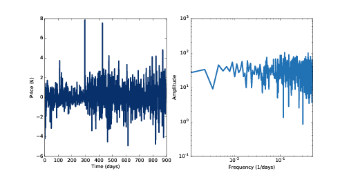
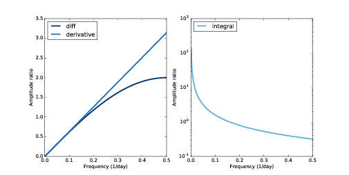
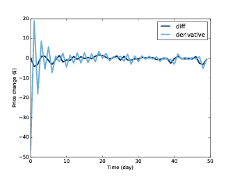
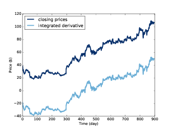
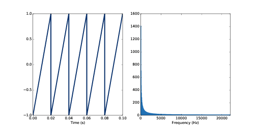
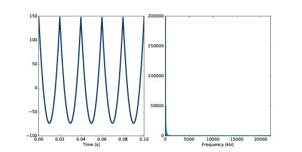
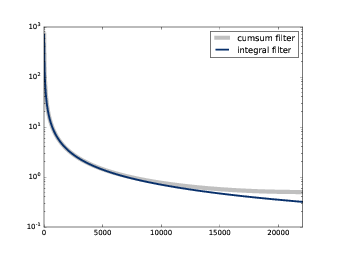
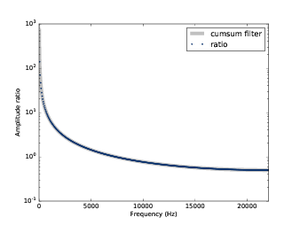

第九章：微分和积分
========================

这一章中，我们会继续分析时域中的窗函数和频域中的滤波的关系。
更具体的说，我们会分析有限差分（近似于微分）以及累加（近似于积分）两种操作的作用。

这章的代码 ``chap09.ipynb`` 可以在本书的 `代码库`_ 中找到，你也可以在 http://tinyurl.com/thinkdsp09 查看。

.. _代码库: https://github.com/AllenDowney/ThinkDSP

9.1 有限差分
---------------

在 :ref:`8.1 平滑` 中，我们对Fackbook的股价数据运用了一个平滑操作，发现在时域上平滑窗的作用
等价于在频域上的低通滤波。

在这一节中，我们来尝试计算它们每日价格差，你会发现在频域上，这相当于高通滤波的作用。

下面的代码从文件中读取数据保存到波形对象中并计算了它的频谱::

    import pandas as pd

    names = ['date', 'open', 'high', 'low', 'close', 'volume']
    df = pd.read_csv('fb.csv', header=0, names=names)
    ys = df.close.values[::-1]
    close = thinkdsp.Wave(ys, framerate=1)
    spectrum = wave.make_spectrum()

代码使用Pandas读取了数据，结果为 ``DataFrame`` 对象 ``df`` ，它的每一列代表了一天的开盘价，收盘价和最高最低价。
我选择了收盘价作为我们分析的数据，并把它保存到了波形对象中，这里的采样率为每天1次。

.. _图9.1:

.. figure:: images/thinkdsp048.png
    :alt: Daily closing price of Facebook and the spectrum of this time series
    :align: center

    图9.1： Fackbook股票收盘价的波形和频谱图

`图9.1`_ 展示了这些数据的波形和频谱图。直观上看，这个波形类似 :ref:`4.3 <4.3 布朗噪声>` 中的布朗噪声。
它的频谱看起来近似一条带有噪声的直线，斜率大约是-1.9， 与布朗噪声一样，它的斜率是常值。

接下来，我们使用 ``np.diff`` 来计算它的每日价格变化情况::

    diff = np.diff(ys)
    change = thinkdsp.Wave(diff, framerate=1)
    change_spectrum = change.make_spectrum()

`图9.2`_ 展示了结果的波形和频谱。可见，每日的变化曲线类似于白噪声，频谱近似一条平的直线，斜率大概是-0.06，接近于0，
这和白噪声是一样的。

.. _图9.2:

    图9.2： Fackbook股票每日价格变化的波形和频谱图

9.2 频域
--------------

实际上，计算相邻元素的差值与差分窗 *[1,-1]* 的卷积是一样的。你有可能会觉得这两个元素的值反了，实际上没有，
记住卷积的操作会先对窗函数进行反向的操作。

我们计算出了这个窗的DFT来看看它在频域上的作用效果::

    diff_window = np.array([1.0, -1.0])
    padded = thinkdsp.zero_pad(diff_window, len(close))
    diff_wave = thinkdsp.Wave(padded, framerate=close.framerate)
    diff_filter = diff_wave.make_spectrum()

如 `图9.3`_ 左图所示，有限差分窗对应了一个高通滤波器，它的幅值随着频率的增大而增大，
在低频的时候是线性的，而随着频率增大，曲线慢慢变平。下一节中，我们会分析这个原因。

.. _图9.3:

        and integration operator (right, log-y scale)
    :align: center

    图9.3： 差分和微分操作（左）以及积分操作（右）图的滤波效果

9.3 微分
-------------

上一节我们用到的差分窗其实是一阶微分的数值近似，因此滤波效果和微分也是近似的。

时域的微分在频域上也相当于一个滤波器，下面我们会用一些数学推导来说明这一点。

假设我们有一个频率为 *f* 的复指数信号：

.. math::

    {E_f}(t) = {e^{2\pi ift}}

它的一阶微分是：

.. math::

    \frac{d}{{dt}}{E_f}(t) = 2\pi if{e^{2\pi ift}}

这个式子又可以写成：

.. math::

    \frac{d}{{dt}}{E_f}(t) = 2\pi if{E_f}(t)

也就是说，对复指数信号进行微分等价于乘以 :math:`2\pi if` ，
这个一个模为 :math:`2\pi f` 相角为 :math:`2\pi` 的复数。

因此，我们可以构造如下的滤波器来代替微分运算::

    deriv_filter = close.make_spectrum()
    deriv_filter.hs = PI2 * 1j * deriv_filter.fs

为了和之前的数据长度和采样率保持一致，这里我先使用了 ``close`` 的频谱数据，
然后将它的 ``hs`` 替换为了  :math:`2\pi if` 。 如 `图9.3` 左图所示，
它是一条直线。

如 :ref:`7.4 <7.4 使用矩阵进行合成>` 所述，复指数信号乘以一个复数实际上产生了两种效果：
一是乘以一个幅值，这里是  :math:`2\pi f` ；二是移动一个初始相位，这里是  :math:`2\pi` 。

如果你了解特征函数的话，复指数函数实际上就是微分算子的特征函数，
对应的特征值是  :math:`2\pi if` 。参见 http://en.wikipedia.org/wiki/Eigenfunction 。

如果你对此不熟悉，下面我会简单的解释一下它的含义：

* 算子是指从一个函数到另一个函数的映射关系。例如微分就是一个算子。

* 对于算子 *A* 和函数 *g* ，如果将 *A* 应用到 *g* 的结果
    与 *g* 本身乘以一个标量值 :math:`\lambda` 相等，即 :math:`Ag = \lambda g` ，
    那么我们称 *g* 是 *A* 的特征函数。

* 相对应的，我们称标量 :math:`\lambda` 为特征函数 *g* 的特征值。

* 一个给定的算子可以有多个特征函数，每个特征函数均对应一个特征值。

由于复指数信号是微分算子的特征函数，因此我们可以很容易的通过乘以一个复数来计算它的微分。

而对于包含多个频率成分的信号来说，要稍微复杂一些：

1. 将信号表示成不同频率的复指数信号之和。

2. 计算每个频率成分的微分（乘法）

3. 将不同频率的微分结果累加

上面的过程看起来和 :ref:`8.6 <8.6 高效的卷积>` 中卷积的算法是一样的，先计算DFT，然后运用一个滤波器，
然后再进行IDFT。

``spectrum`` 类中提供了一个方法来计算差分滤波::

    # class Spectrum:

        def differentiate(self):
            self.hs *= PI2 * 1j * self.fs

我们可以使用这个方法来计算Facebook数据的微分::

    deriv_spectrum = close.make_spectrum()
    deriv_spectrum.differentiate()
    deriv = deriv_spectrum.make_wave()

`图9.4`_ 比较了使用差分 ``np.diff`` 和微分分别计算每日价格变化的曲线。
为了让结果显示的更清晰，这里我们截取了前50个元素来作图。

.. _图9.4:

        and by applying the differentiation filter.
    :align: center

    图9.4： 差分和微分操作的效果比较

图中可以看出，微分的结果更接近于噪声，因为它的高频分量的幅值更大一些，见 `图9.3`_ 左图。
而且它的前面几个值比后面噪声的程度更大，这是由于使用DFT的微分是基于周期性假设的，它将信号
首尾相连而导致了在边界上的不连续。

总结一下，我们展示了：

* 计算相邻元素值之间的差分的方法，它又可以表示成对信号进行一个简单的卷积操作。最后的结果为一阶微分的近似值。

* 时域上的微分相当于频域上的一个滤波器。对于周期信号，它的结果是一阶微分，而对于非周期信号，它的结果近似于一阶微分。

使用DFT来计算微分是求解微分方程的频谱方法的基础，详见 http://en.wikipedia.org/wiki/Spectral_method 。
对于分析线性时不变系统，这个方法特别有用，我们会在第十章中进行介绍。

9.4 积分
--------------

上一节中，我们介绍了时域的微分相当于频域的滤波，它将每个频率分量乘以 :math:`2\pi if` 。
而积分是微分的逆运算，实际上，它相当于把每个频率成分除以 :math:`2\pi if` ，也是一个滤波器。

我们可以这样来计算这个滤波器::

    integ_filter = close.make_spectrum()
    integ_filter.hs = 1 / (PI2 * 1j * integ_filter.fs)

`图9.3`_ 右图是这个滤波器在对数Y轴坐标下的图像。

``Spectrum`` 类提供了一个方法来计算积分滤波::

    # class Spectrum:

        def integrate(self):
            self.hs /= PI2 * 1j * self.fs

为了确保这样计算时正确的，我们将它应用到之前的微分的频谱上::

    integ_spectrum = deriv_spectrum.copy()
    integ_spectrum.integrate()

需要注意的是在 *f=0* 的时候，我们会进行除0操作，那样会引起 *NaN* 
（表示不是一个数 Not a Number）。为了避免这个问题，我们对频率为0的分量
进行特殊的处理，让他的值简单的等于0，然后再生成波形::

    integ_spectrum.hs[0] = 0
    integ_wave = integ_spectrum.make_wave()

`图9.5`_ 中对比了积分运算的结果和原始的数据曲线。显然，积分计算的曲线相当于
原始曲线向下平移了一些。这是由于我们将 *f=0* 的频率幅值设置成了0，而这代表的是
信号的直流分量。不过，其实这也没有什么好奇怪的，因此微分操作后我们就完全丢失了直流
分量的信息，积分运算并不能对这个损失进行恢复。在一定程度上来说，计算结果中的 *NaN*
又表示了这个元素是未知的。

.. _图9.5:

    图9.5： 原始信号和经过微分和积分操作后的信号

当然，如果我们知道这个所谓的“积分常数”，那么积分的结果就是一定的，并且可以保证这个积分滤波器
就是微分滤波器的逆运算。

9.5 累加
---------------

之前我们说差分操作是微分的近似，那么累加就是积分的近似。我通过一个锯齿信号来演示这个操作::

    signal = thinkdsp.SawtoothSignal(freq=50)
    in_wave = signal.make_wave(duration=0.1, framerate=44100)

`图9.6`_ 展示了结果的波形和频谱图。

.. _图9.6:

    图9.6： 锯齿波形和频谱图

``Spectrum`` 类中提供了一个方法来计算波形的累加并返回一个新的波形::

    # class Wave:

        def cumsum(self):
            ys = np.cumsum(self.ys)
            ts = self.ts.copy()
            return Wave(ys, ts, self.framerate)

我们使用这个方法来计算 ``in_wave`` 的累加结果::

    out_wave = in_wave.cumsum()
    out_wave.unbias()

`图9.7`_ 展示了结果的波形和频谱图。如果你认真的完成了第二章后面的练习的话，你就会发现这个波形
与抛物线信号很像。

.. _图9.7:

    图9.7： 抛物线波形和频谱图

抛物线信号的频谱和锯齿信号的频谱相比，幅值的衰减要快很多。第二章中，我们知道锯齿信号的幅值是按照
*1/f* 的规律衰减的，由于累加操作是积分的近似，而积分滤波的效果也相当于按 *1/f* 的规律衰减。
因此累加操作后，幅值就近似按照 :math:`1/{f^2}` 衰减了，这和抛物线信号是一致的。

我们可以这样来计算累加操作所对应的滤波器::

    cumsum_filter = diff_filter.copy()
    cumsum_filter.hs = 1 / cumsum_filter.hs

由于 ``cumsum`` 是 ``diff`` 的逆运算，因此我们将 ``diff_filter`` 的所有值均设置为它的倒数。
`图9.8`_ 对比了累加和积分的频谱响应图。可见累加确实是积分的近似，只是在高频的时候积分滤波器衰减的
稍微要快一些。

.. _图9.8:

    图9.8： 累加和积分滤波的频率响应对比图

为了确保这个滤波器确实和累加操作是一样的效果，我们计算了 ``in_wave`` 和 ``out_wave`` 的频谱比例并进行了对比::

    in_spectrum = in_wave.make_spectrum()
    out_spectrum = out_wave.make_spectrum()
    ratio_spectrum = out_spectrum.ratio(in_spectrum, thresh=1)

上面的 ``ratio`` 方法如下::

    def ratio(self, denom, thresh=1):
        ratio_spectrum = self.copy()
        ratio_spectrum.hs /= denom.hs
        ratio_spectrum.hs[denom.amps < thresh] = np.nan
        return ratio_spectrum

因为当 ``denom.amps`` 很小的时候，相除的结果没太大意义，我们将它直接设置为了 *NaN* 。

`图9.9`_ 中展示了它们的对比结果，可见，它们几乎是一样的。因此，我们可以确信差分滤波器的倒数
就是累加滤波器。

.. _图9.9:

    图9.9： 累加滤波器的频率响应与累加运算前后频谱比例的对比图

最后，我们来验证卷积定理同样适用于积分滤波器::

    out_wave2 = (in_spectrum * cumsum_filter).make_wave()

结果 ``out_wave2`` 在浮点数精度误差内与我们通过 ``cumsum`` 计算出的 ``out_wave`` 是一样的，
所以卷积定理在这里也是适用的。
需要注意的是，这样的验证方法仅仅适用于周期信号。

9.6 噪声的积分
---------------

在 :ref:`4.3 <4.3 布朗噪声>` 中，我们通过对白噪声进行累加来计算出了布朗噪声，现在我们知道了累加操作
在频域上的效果，因此现在我们可以更深入的看一下布朗噪声的频谱。

对于白噪声来说，它的所有频率成分都有同样的平均功率。那么累加操作后，由于每个频率的幅度都被除以了 *f* ，
而功率是幅值的平方，因此对于功率来说，每个频率成分的功率是除以了 :math:`{f^2}` ，也就是说对于频率为 *f*
的分量来说，平均功率与 :math:`1/{f^2}` 是成正比的，可以表示为：

.. math::

    {P_f} = K/{f^2}

上式中个的 *K* 是一个无关紧要的常数。对式子两边求对数后得到：

.. math::

    \log {P_f} = \log K - 2\log f

这也说明了为什么我们将布朗噪声的频谱画到对数坐标下会是一条斜率约为-2的直线。

在 `9.1 <9.1 有限差分>`_ 中，我们画出了Fackbook收盘价的频谱图，并得出它的斜率约为-1.9，这和布朗噪声是基本一致的，
其实很多股票的价格都有类似的频谱。

而当我们使用 ``diff`` 计算差分后，我们实际上是在频域上应用了一个与频率 *f* 成正比的滤波器，也就意味着相应的功率变化
是 :math:`{f^2}` 。在对数坐标下，这个操作将功率谱的直线的斜率增加了2，因此计算结果的斜率约为0.1。（实际上要低一些，因为
``diff`` 操作只是微分的近似）

9.7 练习
-----------------------

下面练习的答案可以参考文件 ``chap09soln.ipynb`` 。

**练习1** 阅读并运行 ``chap09.ipynb`` 中的代码。
在 `9.5 <9.5 累加>`_ 中我提到对于非周期信号是不适用的。试着使用Facebook数据代替锯齿信号进行同样的计算，
看看会有什么问题。

**练习2** 这个练习的目的是探索对信号进行差分和微分的效果。生成一个三角波并画出波形，对他进行 ``diff`` 操作，
并画出结果的波形。计算三角波的频谱并运用微分滤波器然后画出频谱图，再将这个结果反过来计算出波形并画出波形图。
看看这两个波形有什么区别。

**练习3** 这个练习的目的是探索对信号进行累加和积分的效果。生成一个方波并画出波形，对他进行 ``cumsum`` 操作，
并画出结果的波形。计算方波的频谱并运用积分滤波器然后画出频谱图，再将这个结果反过来计算出波形并画出波形图。
看看这两个波形有什么区别。

**练习4** 这个练习的目的是探索进行两次积分后的效果。生成一个锯齿波，计算出它的频谱，然后进行两次积分滤波操作。
画出结果的波形和频谱。看看这个波形在数学上是什么形式的曲线？为什么它会像是正弦信号呢？

**练习5** 这个练习的目的是探索二阶差分和二阶微分的效果。生成一个立方信号 ``CubicSignal`` （在 ``thinkdsp`` 中实现了这个类）
通过计算两次差分 ``diff`` 运算来进行二阶差分，看看结果是什么样的？通过计算两次微分操作来计算二阶微分，看看结果是否一样？
画出相应的二阶差分和二阶微分的滤波器响应图进行对比。
提示：为了是滤波器在相同的刻度下，需要使波形的采样率等于1。
 