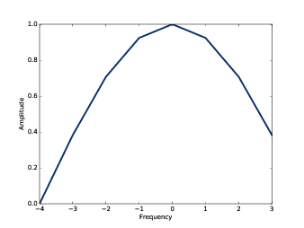
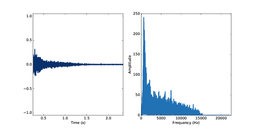
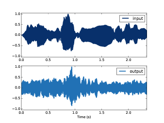

第十章：线性时不变系统
===========================

这章中，我们使用音乐作为例子来介绍一些信号与系统的理论知识。
TODOOOOOOOOOO

这章的代码 ``chap41.ipynb`` 可以在本书的 `代码库`_ 中找到，你也可以在 http://tinyurl.com/thinkdsp10 查看。

.. _代码库: https://github.com/AllenDowney/ThinkDSP

10.1 信号与系统
-----------------

在信号处理领域， **系统（system）** 代表的是接受一个信号为输入并产生一个信号输出的一种抽象概念，
如电子放大器，它是一个把输入信号放大后输出的电路。再比如，在你听音乐的时候，整个房间也可以看做是一个系统，
它将声音从它产生的地方（输入），然后传到你的耳朵里（输出）形成与原来不完全相同的声音。

而 **线性时不变系统（linear, time-invariant system， LTI）** 就是有如下两个性质的一类系统：

1. 线性：如果你同时输入两个不同的信号，那么得到的输出和这两个信号各自的输出之和相同。
   用数学语言描述为，如果输入 *x1* 产生输出 *y1* ，输入 *x2* 产生输出 *y2*，那么
   输入 *ax1+bx2* 产生的输出为 *ay1+by2* 。这里 *a* 和 *b* 为常数。

2. 时不变性：系统的作用效果不随时间的变化而变化，仅依赖于系统本身的状态。因此，如果输入变化仅是在时间上平移，
   那么产生的输出变化也仅仅是相同的时间平移，其他都是一样的。

很多物理系统都具有这两个性质，或是近似的具有这两个性质。

* 仅包含电阻，电容和电感的电路系统是LTI。这里我们只把这些元件考虑为理想模型。

* 包含弹簧，块和阻尼装置的机械系统同样是LTI。这里假定弹簧和阻尼器是线性的（力与位移成正比，力与速度成正比）

* 本书中的讲的最多的声音的传输介质（包括空气，水和固体等）也可以使用LTI作为近似模型。

LTI可以由线性微信方程描述，而它的解可以用复指数函数来表示，
见 http://en.wikipedia.org/wiki/Linear_differential_equation 。

我们可以运用这个结论来计算输入信号作用与一个LTI后的输出：

1. 将输入信号表示为不同频率的复指数函数之和。

2. 对每个分量计算相应的输出

3. 将所有的输出加起来就得到了最终的输出

这看上去又很熟悉，它与 :ref:`8.6 <8.6 高效的卷积>` 计算卷积使用的算法以及 :ref:`9.3 <9.3 微分>` 计算微分的算法
是一个道理。这种方法我们成为 **频谱分解** ，因为我们将输入信号“分解”成了频谱中的各个成分然后分别进行处理。

为了运用这个方法，我们需要找到每个频率成分作用于系统后产生的效果，以此来描述这个系统。对于，机械系统来说，有一个简单
有效的方法来完成这件事，就是触发一下并记录输出结果。

更准确的说，我们把触发一下这个操作叫做对系统输入一个 **脉冲（impulse）** ，
而产生的输出我们称为 **脉冲响应（impulse response）** 。也就是说，对于线性系统，脉冲响应可以完全的表征系统的特性，
我们可以从脉冲的DFT结果看出其中的原因。下面我们生成了一个脉冲信号::

    impulse = np.zeros(8)
    impulse[0] = 1
    impulse_spectrum = np.fft.fft(impulse)

这个信号的值是::

    [ 1.  0.  0.  0.  0.  0.  0.  0.]

而它的频谱的值是::

    [ 1.+0.j  1.+0.j  1.+0.j  1.+0.j  1.+0.j  1.+0.j  1.+0.j  1.+0.j]

频谱中所有频率成分都是1。也就是说脉冲信号是包含所有频率成分并且它们具有相同幅值的信号。
注意不要与白噪声的频谱混淆了，白噪声的所有频率成分只是平均功率一样。

基于上面的分析，由于系统是线性时不变的，当我们对系统输入一个脉冲信号时其实相当于输入了所有的频率成分也就得到了
所有频率成分的响应。

.. admonition:: 译者注

    从时域上看，任何信号均可以分解为不同时移脉冲信号乘以幅值之和，由于LTI的叠加性，任何信号的输出都可以由脉冲响应来
    出，实际上输出就是输入信号和脉冲响应的卷积。
    
    从频域上看，复指数信号是LTI的特性信号，即输入复指数信号后的输出是同频率的复指数信号，只有幅值相位的改变。因此只要
    知道了系统对所有频率的复指数信号的响应就可以完全的确定系统的特性。而脉冲信号正是一个包括所有频率的信号。

10.2 窗和滤波器
----------------

为了展示使用脉冲响应来描述系统是可行的，我先从一个简单例子开始：一个包含两个元素的移动平均窗。我们可以把它当作是一个
对输入信号进行平滑的系统。

这个例子中，我们事先知道了系统使用的窗函数，因此我们可以直接计算它的滤波响应，但是实际情况，我们通常事先是不知道窗函数或滤波器
的形式的，之后我们会分析这种情况。

下面的代码生成了这个移动平均窗，并计算了它的DPF得到了滤波响应::

    window_array = np.array([0.5, 0.5, 0, 0, 0, 0, 0, 0,])
    window = thinkdsp.Wave(window_array, framerate=8)
    filtr = window.make_spectrum(full=True)

结果如 `图10.1`_ ，它是一个低通滤波器，滤波响应形状近似高斯曲线。

.. _图10.1:

    图10.1： 两个元素的移动平均窗的DFT结果

现在，假定我们不知道窗函数或者滤波响应，我们就可以通过输入脉冲信号得到的脉冲响应，来描述这个系统。

这个例子中，我们将脉冲信号的频谱乘以滤波响应来得到了脉冲响应的频谱，然后由频谱生成了波形::

    product = impulse_spectrum * filtr
    filtered = product.make_wave()

由于 ``impulse_spectrum`` 的值都是1，相乘之后结果与滤波器是相同的，同样，最后得到的波形和窗函数也是一样的。

这个例子说明两点：

* 由于脉冲信号的频谱都是1，因此脉冲响应的DFT与系统的滤波响应是相同的。

* 脉冲响应与描述系统的卷积窗也是相同的。

10.3 声学响应
-----------------

由上一节的结论我们知道，为了描述一个房间或开放空间的声学响应特性，可以简单的生成一个声音脉冲，可以用气球爆炸或开枪的声音
作为近似，然后得到的声音就是脉冲响应的近似。

我们以枪声作为例子生成脉冲响应来买描述一个房间的声学特性，然后使用它来模拟这个房间中录制的小提琴声音。

你可以在 `代码库`_ 中的 ``chap10.ipynb`` 上（或http://tinyurl.com/thinkdsp10）运行这个例子，然后听一听。

下面的代码是枪声::

    response = thinkdsp.read_wave('180961__kleeb__gunshots.wav')
    response = response.segment(start=0.26, duration=5.0)
    response.normalize()
    response.plot()

为了去除开枪前的空数据，我选择了从0.26s开始的一段。 `图10.2`_ 左图展示了枪声的波形。

.. _图10.2:

    图10.2： 枪声波形

接下来，我们计算 ``response`` 的DFT::

    transfer = response.make_spectrum()
    transfer.plot()

结果如 `图10.2`_ 右图。这个频谱就代表了这个房间的声学响应特性。频谱中每个频率成分都包含了一个表示幅值和初始相位的复数，
由于它包含了系统从输入到输出的所有信息，因此又被称为 **传递函数（transfer function）** 。

现在，我们可以模拟在这个房间内的小提琴声音，下面的代码是我们在 :ref:`1.1 <1.1 周期信号>` 中使用的小提琴录音::

    violin = thinkdsp.read_wave('92002__jcveliz__violin-origional.wav')
    violin.truncate(len(response))
    violin.normalize()

它和枪声的采样率都是44100Hz，它们的长度也大致相同，我调整了小提琴波形的长度使它们的长度一致。

然后，计算出小提琴波形的DFT::

    spectrum = violin.make_spectrum()

现在，我们知道了信号的每个频率成分的幅值和初始相位，也知道了系统的传递函数，它们的乘积就是最终输入信号的DFT，
以此我们就可以反过来算出输出信号的波形::

    output = (spectrum * transfer).make_wave()
    output.normalize()
    output.plot()

.. _图10.3:

    图10.3： 经过系统前后的小提琴波形图

`图10.3`_ 中上图为输入信号波形，下图为输出信号波形。它们的波形是不一样的，并且你可以听出这个差别。
可以在 `chap10.ipynb` 中听一听，从中也许你可以感觉出这个房间的样子，对于我们来说，它听起来像是一个
狭长的房间，有硬质的地板和顶，像是一个靶场。

其实在这个例子中，为了避免带来一些困惑，我忽略了一件事，就是我们使用的原始的小提琴声音也是在某个房间录制的，
也就是说它已经经过了一次系统的传递，所以我们计算出的声音其实是经过了两个系统传递后的声音。如果想要真正的
模拟在另一个房间中的声音，应该先对录音进行一次逆向的传递函数处理。

10.4 系统和卷积
-------------------

