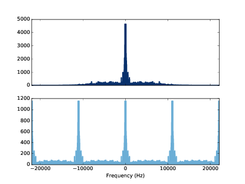
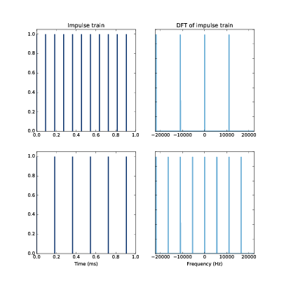
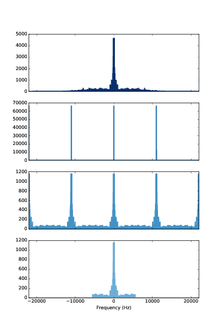
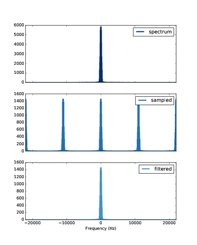
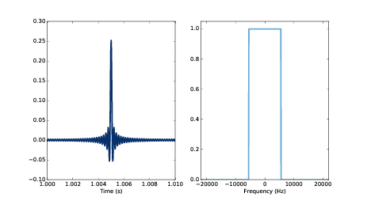
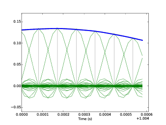

第十一章：调制和采样
====================

在 :ref:`2.3 <2.3 混叠>` 中我们知道，当信号的采样率为10000Hz时，
5500Hz的频率与4500Hz的频率是区分不出来的，这时的折叠频率为5000Hz，
也就是采样率的一般。当时，我并没有解释原因。

这章我们来研究采样以及采样定理，解释混叠以及折叠频率的原因。

我会先从脉冲的卷积开始来解释调幅（AM）的过程，这对理解采样定理是很有用的。

这章的代码 ``chap11.ipynb`` 可以在本书的 `代码库`_ 中找到，你也可以在 http://tinyurl.com/thinkdsp11 查看。

.. _代码库: https://github.com/AllenDowney/ThinkDSP

1.1 脉冲卷积
---------------

在 :ref:`10.4 <10.4 系统和卷积>` 中我们得知信号与一系列脉冲的卷积的结果就是信号进行时移和缩放后的和。
这里，我以一个蜂鸣声作为例子::

    filename = '253887__themusicalnomad__positive-beeps.wav'
    wave = thinkdsp.read_wave(filename)
    wave.normalize()

然后构造包含四个脉冲的波形::

    imp_sig = thinkdsp.Impulses([0.005, 0.3, 0.6,  0.9], 
                       amps=[1,     0.5, 0.25, 0.1])
    impulses = imp_sig.make_wave(start=0, duration=1.0, 
                                framerate=wave.framerate)

然后对他们进行卷积::

    convolved = wave.convolve(impulses)

结果如 `图11.1`_ ，输入信号为左上图，脉冲序列为左下图，卷积结果为右图。

.. _图11.1:

.. figure:: images/thinkdsp063.png
    :alt:  The effect of convolving a signal (top left) with a series of impulses (bottom left). 
        The result (right) is the sum of shifted, scaled copies of the signal
    :align: center

    图11.1： 蜂鸣声（左上）与脉冲序列（左下）的卷积结果（右）

你可以在 ``chap11.ipynb`` 中播放这个声音，它听起来就是四个逐渐衰减的蜂鸣声。

这个例子演示了信号与脉冲序列卷积的结果，这对于之后的分析是很有用的。

11.2 幅度调制
----------------

幅度调制（调幅，AM）被广泛用于调幅广播和其他一些应用中。信号（包括语音，音乐等）
以与载波相乘的方式被调制到载波上，经过发射装置发送出去。一般载波都是适用于无线电广播的
高频信号，在美国，AM广播的频率为500~1600kHz，参见 https://en.wikipedia.org/wiki/AM_broadcasting 。

而在接收端，需要从广播信号中恢复出原始的信号，这个过程就是解调。令人惊讶的是，解调也是通过与同样的载波
相乘来计算出来的。为了说明工作原理，我将一个信号调制到了10kHz的载波上，信号如下::

    filename = '105977__wcfl10__favorite-station.wav'
    wave = thinkdsp.read_wave(filename)
    wave.unbias()
    wave.normalize()

载波如下::

    carrier_sig = thinkdsp.CosSignal(freq=10000)
    carrier_wave = carrier_sig.make_wave(duration=wave.duration, 
                                        framerate=wave.framerate)

我们可以直接使用乘法来进行调制的操作::

    modulated = wave * carrier_wave

这个信号的声音很难听，你可以在 ``chap11.ipynb`` 中播放它。

.. _图11.2:

.. figure:: images/thinkdsp063.png
    :alt:  Demonstration of amplitude modulation. The top row is the spectrum of the signal; 
        the next row is the spectrum after modulation; the next row is the spectrum after demodulation; 
        the last row is the demodulated signal after low-pass filtering
    :align: center

    图11.2： 幅度调制示意图

如 `图11.2`_ 展示了调幅在频域的变化过程。顶部是原始信号的频谱，接下来是调制后的信号频谱，也就是与载波相乘之后的信号，
它包含了原始频谱的两个拷贝，分别向左右平移了10kHz。

我们知道时域的卷积等于频域的乘积，反过来其实也成立，时域的乘积等于频域的卷积。当我们将信号乘以载波的时候，在频域上，
就相当于把信号的频谱与载波的频谱进行了卷积。

由于载波是简单的余弦信号，它的DFT仅包含两个脉冲，10kHz以及-10kHz。由上一节可知，与脉冲序列的卷积等于信号平移和缩放后的和。
注意经过调制之后，频谱的幅值减小了，这个因为原始实现的能量变分散到了两个部分中。

我们再通过乘以载波来进行解调::

    demodulated = modulated * carrier_wave

`图11.2` 的第3个图展示了结果的频谱，这个结果就是图2经过平移缩放后得到的。由于调制后的频谱具有两边对称的峰值，
每个峰值都被分成了左右平移10kHz，幅值为一半两个部分，两边的0kHz部分正好重合到了一起。而另外两个部分分别是
20kHz以及-20kHz。

解调后的信号听上去恢复的很好，虽然其中包含了一些原始信号没有的高频成分，但是这些频率太高了，大部分播放设备播放不出来，
而且我们的耳朵也听不到。当然，如果你的播放设备足够好，而你又有一个足够好的耳朵，你也许可以听到。

这种情况，我们其实可以使用一个低通滤波器将额外的高频成分滤掉::

    demodulated_spectrum = demodulated.make_spectrum(full=True)
    demodulated_spectrum.low_pass(10000)
    filtered = demodulated_spectrum.make_wave()

这样结果就和原始信号更接近了，只是在解调和滤波后损失了一半的功率。这在实际应用中并不是一个问题，
因为实际上大部分的功率都损失到了广播信号的发射，传播和接收上，不过我们只要把解调后的信号再进行
放大就可以了。

11.3 采样
--------------

上一节我们介绍了幅度调制，它可以帮助我们理解采样。采样（sampling）就是在一系列的时间点上
（通常是等间隔的）对一个模拟信号进行测量得到一系列的数字测量值的过程。

例如我们之前使用WAV文件，就是使用模数转换器（ADC）对麦克风的输出进行采样后保存成的文件。
大多数音频的采样率为44.1kHz，这个标准的CD音质的采样率，而使用48kHz的采样率为标准DVD音质的采样率。

在48kHz采样率之下，折叠频率是24kHz，这比我们大部分能听到到最高的频率还要高。
参见  https://en.wikipedia.org/wiki/Hearing_range 。

大多数的声音波形，每个采样值为16位（bits），也就是有 :math:`{2^{16}}` 个等级，这也被称为位宽。
:math:`{2^{16}}` 的位宽对于声音来说就已经足够了，即使再增大，我们也感觉不到音质的提升了。
参见 https://en.wikipedia.org/wiki/Digital_audio 。

当然，对于音频信号以外的其他信号来说，有的需要更高的采样率以捕捉到更高的频率，有的需要更大的位宽以
提高波形的保真度。

为了演示采样的过程，我还是先从一个44.1kHz采样率的波形开始。然后中波形中用11kHz的采样率再采样一次。
这与直接从模拟信号上采样是不完全一样的，但效果其实差不多。

首先，我加载了一段单独的鼓声::

    filename = '263868__kevcio__amen-break-a-160-bpm.wav'
    wave = thinkdsp.read_wave(filename)
    wave.normalize()

.. _图11.3:

    图11.3： 信号采样前后的频谱图

`图11.3`_ 上图显示了这个波形的频谱，下面是对这个波形进行采样的函数::

    def sample(wave, factor=4):
        ys = np.zeros(len(wave))
        ys[::factor] = wave.ys[::factor]
        return thinkdsp.Wave(ys, framerate=wave.framerate)

然后使用这个函数从原始信号每4个值中抽取一个值作为采样后的波形::

    sampled = sample(wave, 4)

最后的结果与原始波形具有相同的采样率，但是其中大部分元素都是0。如果你播放这段采样后的波形，
它听起来不会很好听，它相比原始的信号引入了一些高频的成分。

`图11.3`_ 下图显示了采样后的频谱图。它是原始信号的频谱复制了四份（图中看上去是5份，但是其实边上的
两个其实一个被分成了两份）

与上一节类似，采样过程可以看做是信号与一系列的脉冲的乘积，因此产生了相同的效果。除了使用 ``sample``
以外，我们还可以使用下面这个函数来进行采样，这种方法有时被叫做 **脉冲序列（impulse train）** ::

    def make_impulses(wave, factor):
        ys = np.zeros(len(wave))
        ys[::factor] = 1
        ts = np.arange(len(wave)) / wave.framerate
        return thinkdsp.Wave(ys, ts, wave.framerate)

然后将信号与脉冲序列相乘得到采样信号::

    impulses = make_impulses(wave, 4)
    sampled = wave * impulses

结果与之前是相同的。由于时域的乘积等于频域的卷积，当我们乘以脉冲序列的时候，就相当于在频域上与脉冲序列的频谱
进行卷积。事实证明脉冲序列的DFT同样也是脉冲序列。

.. _图11.4:

    图11.4： 脉冲序列的卷积

`图11.4`_ 中，上面两个图是11025Hz的脉冲序列的波形和频谱。可以看出它的DFT是包含4个脉冲的脉冲序列，这就是为什么
上例会得到原始频谱的四个复制。下面两个图是5512Hz的脉冲序列的波形和频谱。它的DFT是8个脉冲。一般来说，时域上
有更多从脉冲，在频谱上就会有更少的脉冲。

总结起来就是：

1. 采样过程可以看做是信号与采样序列的乘积。

2. 时域上乘以采样序列，相当于在频域上与一个采样序列的卷积

3. 与采样序列的卷积后的频谱是原始频谱的周期延拓

11.4 混叠
--------------

在 `11.2 <11.2 幅度调制>`_ 中，我们对解调后的AM信号使用了低通滤波器来去掉多于的频谱部分。
而对于采样来说这样做并不是一个完美的方案。

.. _图11.5:

        spectrum of the sampled wave (third row), after low-pass filtering (bottom)
    :align: center

    图11.5： 鼓声（第1行），脉冲序列（第2行），采样信号（第3行），低通滤波信号（第4行）的频谱图

`图11.5`_ 说明了为什么这样做会有什么问题。其中第一行的图是原始信号的频谱，它包含了超过10kHz的高频成分，
当我们对他进行采样，相当于频域上与一个脉冲序列进行卷积，第二行的图就是这个脉冲序列的频谱。卷积后得到了
采样信号的频谱（第三行），第四行的图是采样信号经过5512Hz截止频谱的低通滤波后的频谱。

虽然，将结果反算出波形后，与原始信号是相似的，但是其实有两个问题：

* 经过低通滤波后，原始信号中高于截止频谱5512Hz的频谱成分丢失了

* 并且低于5512Hz的频率成分中叠加其他左边原始频谱的右半部分。

也就是说，如果相邻的两个频谱复制重叠了，那么在采样后，我们就不能从中把原始信号恢复出来了。

但是，如果没有重叠的话，这个方法还是很好的，下面的例子我使用了一段贝斯的声音。

.. _图11.6:

        and after filtering (bottom)
    :align: center

    图11.6： 贝斯的频谱（上），采样后的频谱（中），滤波后的频谱（右）

如 `图11.6`_ 所示，它的频谱（上图）中几乎看不到大于5512Hz的频谱成分，中图则是采样后的频谱，
下图是滤波后的频谱。由于滤波会导致能量的损失，因此滤波后的频谱的幅值变小了，但是频谱的形状与
原始信号是完全一样的，滤波后的波形听上去和原始声音也是完全一样的。

11.5 内插
--------------

上一节中我们使用的滤波器又叫做 **矩形滤波器（brick wall filter）** ，它对于高于截止频率的成分
是完全消除的。

.. _图11.7:

    图11.7： 矩形滤波器（右）和它的卷积窗（左）

`图11.7`_ 右图显示了这个滤波器的图形。由于频域上相乘等于时域上卷积，也就是与滤波器的卷积窗进行卷积。
它的卷积窗就是频谱的IDFT（右图）。这个函数有一个特殊的名字叫 **辛格函数（sinc function）** （实际上是
它的离散形式），参见 https://en.wikipedia.org/wiki/Sinc_function ：

.. math::

    sinc(x) = \frac{{\sin \pi x}}{{\pi x}}

当应用这个滤波器的时候，就相当于与 *sinc* 函数进行卷积。

*sinc* 函数在0时刻的值是1，而当 *x* 为其他整数的时候，它的值均为0 。因此当与这个函数进行卷积的时候，
在采样点上得到的值严格的等于采样值，因此卷积的过程实际上就是对采样点进行内插。

.. _图11.8:

        interpolating sinc functions (thin curves), and the original wave (thicker line across the top
    :align: center

    图11.8： 采样值（灰线），sinc函数内插（绿线）和原始信号（蓝线）

`图11.8`_ 中使用一小段信号来展示了内插的过程。其中蓝线为原始信号，绿线是卷积中使用的一系列sinc函数经过时移和缩放的
曲线，它们的和等于原始信号。灰线是采样信号。
我再重新强调一次：

* 这些sinc函数的和等于原始信号

这是因为原始信号没有高于5512Hz的频率成分，在11025Hz的采样率下，我们可以完成的重建原始信号。当然，如果我们有原始信号的
频谱，也可以准确的重建原始信号。

上面的例子，我们先从一个44100Hz采样率的信号开始，然后以11025Hz的采样率进行重新采样，采样后的频谱是原始频谱的周期延拓，
周期是11025Hz。

如果原始信号没有高于5512Hz的频率成分，那么周期延拓后的频谱就不会重叠，在滤波后就不会丢失信息，也就可以完全的重建信号。

这就是所谓的香农采样定理，见 https://en.wikipedia.org/wiki/Nyquist-Shannon_sampling_theorem 。

之前我们的讨论都是具有原始信号是在44.1kHz采样率下进行的。实际上，原始信号采样率无关紧要，它的采样率可以更高，甚至是连续的模拟信号，
这个定理都是成立的：当以采样率 *f* 对信号进行采样后，只要信号不包含高于 *f/2* 的频率成分，我们就可以准确的从采样信号中重建原始信号。
这种信号又叫做 **有限带宽信号（bandwidth limited）** 。

.. admonition:: 译者注

    总结：时域中的连续信号经脉冲序列采样后会在频域产生周期延拓，周期等于采样频率；
    只有采样频率足够高，大于原始信号频谱中最高频率的两倍，则采样后频谱就不会发生混叠。
    为了恢复信号，可以把采样信号通过一个矩形滤波器，而矩形滤波器的窗函数就是sinc函数。
    因此将采样后的信号与sinc信号进行卷积就可以重建信号，这个过程就是内插。

11.6 小结
---------------

恭喜你已经完成了本书的所有内容（除了本章的练习以外），在结束之前，我重新总结一下所有的内容：

* 我们从周期信号开始，介绍了 ``thinkdsp`` 模块中的几个关键类： ``Signal`` ， ``Wave`` ， ``Spectrum`` 。

* 学习了简单波形以及乐器的谐波结构，并且看到了混叠的效果。

* 学习了声谱图用来分析啁啾声以及其他的频谱随时间变化的信号。

* 生成并分析了噪声信号，对自然界的噪声信号特性有了一定的了解。

* 学习了自相关函数，并用它来进行音高估计，以及描述了噪声的另外一些特性。

* 学习了离散余弦变换，它在数据压缩中应该很广，然后又进一步学习了离散傅立叶变换。

* 使用复指数信号来合成复信号，并通过它的逆向过程得到了DFT。如果你做了那张的练习，就会实现快速傅立叶变换了，这个算法是20世纪最重要的算法之一。

* 从平滑开始，我们学习了卷积以及卷积定理，它描述了时域的操作（如平滑）在频域上的滤波作用。

* 探索了微分和积分操作的滤波作用，他们是求解微分方程的频谱方法的基础。我们还解释了前面章节中的一些遗留问题，例如白噪声和布朗噪声的关系。

* 学习了线性时不变系统，并使用卷积定理将LTI系统描述为它的脉冲响应。

* 演示了幅度调制的过程，这在广播通信中很重要。并且进一步学习了采样定理，这个定理是数字信号处理的关键。

至此，你应该具有了使用计算工具对信号和频谱进行分析的实践知识以及如何进行采样和滤波等工作的理论知识了。

希望你能够从中找到感兴趣的东西。谢谢！

11.7 练习
-------------

下面练习的答案可以参考文件 ``chap11soln.ipynb`` 。

**练习1** 阅读并且运行 ``chap11.ipynb`` 上面的代码示例，听一听示例中的音频。

**练习2** Chris “Monty” Montgomery 有一个很好的视频，
叫做“D/A and A/D | Digital Show and Tell”
它演示了采样定理并且展示了很多关于采样的很好的知识，
观看这个视频 https://www.youtube.com/watch?v=cIQ9IXSUzuM 。

**练习3** 如果我们使用一个比较低的采样率进行采样，高于折叠频率的部分就会混叠，一旦发生混叠，
我们就不可能完全重建信号了，因为这些频率成分采样和低频的成分完全一样区别不出来了。
我们可以在采样之前对信号进行低通滤波，滤除这部分频率成分，这种滤波就叫 **抗混叠滤波器（anti-aliasing filter）** 。

回到之前鼓声的例子，在采样前对信号进行低通滤波，采样后在使用低通滤波去掉频谱周期延拓的部分。
看看最后恢复的信号和滤波后的信号是否是一样的。

