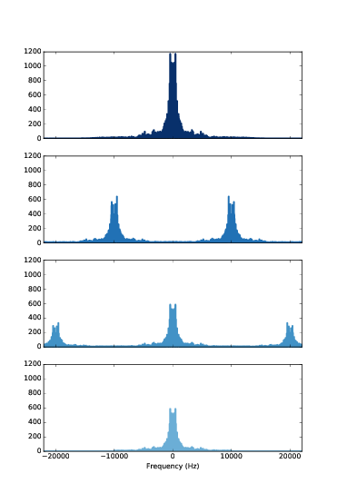

第十一章：调制和采样
====================

在 :ref:`2.3 <2.3 混叠>` 中我们知道，当信号的采样率为10000Hz时，
5500Hz的频率与4500Hz的频率是区分不出来的，这时的折叠频率为5000Hz，
也就是采样率的一般。当时，我并没有解释原因。

这章我们来研究采样以及采样定理，解释混叠以及折叠频率的原因。

我会先从脉冲的卷积开始来解释调幅（AM）的过程，这对理解采样定理是很有用的。

这章的代码 ``chap11.ipynb`` 可以在本书的 `代码库`_ 中找到，你也可以在 http://tinyurl.com/thinkdsp11 查看。

.. _代码库: https://github.com/AllenDowney/ThinkDSP

1.1 脉冲卷积
---------------

在 :ref:`10.4 <10.4 系统和卷积>` 中我们得知信号与一系列脉冲的卷积的结果就是信号进行时移和缩放后的和。
这里，我以一个蜂鸣声作为例子::

    filename = '253887__themusicalnomad__positive-beeps.wav'
    wave = thinkdsp.read_wave(filename)
    wave.normalize()

然后构造包含四个脉冲的波形::

    imp_sig = thinkdsp.Impulses([0.005, 0.3, 0.6,  0.9], 
                       amps=[1,     0.5, 0.25, 0.1])
    impulses = imp_sig.make_wave(start=0, duration=1.0, 
                                framerate=wave.framerate)

然后对他们进行卷积::

    convolved = wave.convolve(impulses)

结果如 `图11.1`_ ，输入信号为左上图，脉冲序列为左下图，卷积结果为右图。

.. _图11.1:

        The result (right) is the sum of shifted, scaled copies of the signal
    :align: center

    图11.1： 蜂鸣声（左上）与脉冲序列（左下）的卷积结果（右）

你可以在 ``chap11.ipynb`` 中播放这个声音，它听起来就是四个逐渐衰减的蜂鸣声。

这个例子演示了信号与脉冲序列卷积的结果，这对于之后的分析是很有用的。

11.2 幅度调制
----------------

幅度调制（调幅，AM）被广泛用于调幅广播和其他一些应用中。信号（包括语音，音乐等）
以与载波相乘的方式被调制到载波上，经过发射装置发送出去。一般载波都是适用于无线电广播的
高频信号，在美国，AM广播的频率为500~1600kHz，参见 https://en.wikipedia.org/wiki/AM_broadcasting 。

而在接收端，需要从广播信号中恢复出原始的信号，这个过程就是解调。令人惊讶的是，解调也是通过与同样的载波
相乘来计算出来的。为了说明工作原理，我将一个信号调制到了10kHz的载波上，信号如下::

    filename = '105977__wcfl10__favorite-station.wav'
    wave = thinkdsp.read_wave(filename)
    wave.unbias()
    wave.normalize()

载波如下::

    carrier_sig = thinkdsp.CosSignal(freq=10000)
    carrier_wave = carrier_sig.make_wave(duration=wave.duration, 
                                        framerate=wave.framerate)

我们可以直接使用乘法来进行调制的操作::

    modulated = wave * carrier_wave

这个信号的声音很难听，你可以在 ``chap11.ipynb`` 中播放它。

.. _图11.2:

        the next row is the spectrum after modulation; the next row is the spectrum after demodulation; 
        the last row is the demodulated signal after low-pass filtering
    :align: center

    图11.2： 幅度调制示意图

如 `图11.2`_ 展示了调幅在频域的变化过程。顶部是原始信号的频谱，接下来是调制后的信号频谱，也就是与载波相乘之后的信号，
它包含了原始频谱的两个拷贝，分别向左右平移了10kHz。

我们知道时域的卷积等于频域的乘积，反过来其实也成立，时域的乘积等于频域的卷积。当我们将信号乘以载波的时候，在频域上，
就相当于把信号的频谱与载波的频谱进行了卷积。

由于载波是简单的余弦信号，它的DFT仅包含两个脉冲，10kHz以及-10kHz。由上一节可知，与脉冲序列的卷积等于信号平移和缩放后的和。
注意经过调制之后，频谱的幅值减小了，这个因为原始实现的能量变分散到了两个部分中。

我们再通过乘以载波来进行解调::

    demodulated = modulated * carrier_wave

`图11.2` 的第3个图展示了结果的频谱，这个结果就是图2经过平移缩放后得到的。由于调制后的频谱具有两边对称的峰值，
每个峰值都被分成了左右平移10kHz，幅值为一半两个部分，两边的0kHz部分正好重合到了一起。而另外两个部分分别是
20kHz以及-20kHz。

解调后的信号听上去恢复的很好，虽然其中包含了一些原始信号没有的高频成分，但是这些频率太高了，大部分播放设备播放不出来，
而且我们的耳朵也听不到。当然，如果你的播放设备足够好，而你又有一个足够好的耳朵，你也许可以听到。

这种情况，我们其实可以使用一个低通滤波器将额外的高频成分滤掉::

    demodulated_spectrum = demodulated.make_spectrum(full=True)
    demodulated_spectrum.low_pass(10000)
    filtered = demodulated_spectrum.make_wave()

这样结果就和原始信号更接近了，只是在解调和滤波后损失了一半的功率。这在实际应用中并不是一个问题，
因为实际上大部分的功率都损失到了广播信号的发射，传播和接收上，不过我们只要把解调后的信号再进行
放大就可以了。

11.3 采样
--------------

